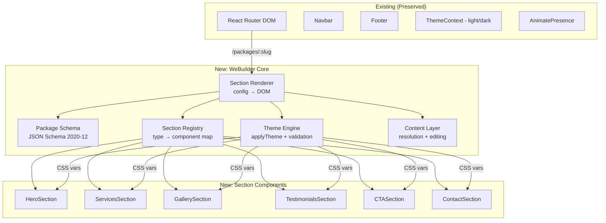
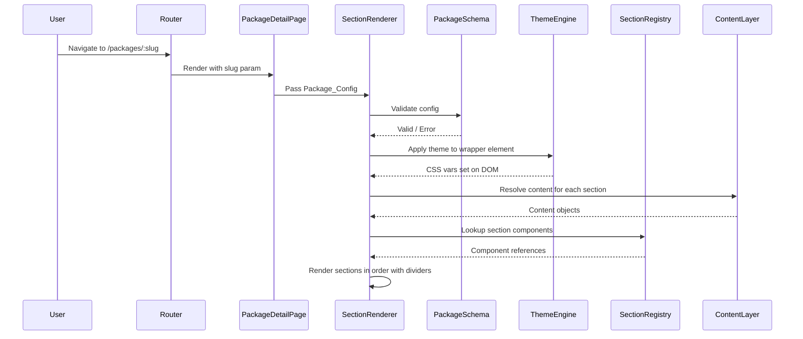

# Design Document: Adverse WeBuilder

## Overview

Adverse WeBuilder transforms the existing hardcoded package rendering system into a config-driven, theme-aware, section-based architecture. The system introduces a centralized Theme Engine, a validated Package Configuration Schema, a dynamic Section Renderer, and a Content Abstraction Layer — all integrated incrementally into the existing React SPA without disrupting current routing, animations, or deployment.

### Design Goals

1. **Config-driven rendering** — Packages defined as JSON configurations, not custom component trees
2. **Centralized theming** — All design tokens managed in one place, applied via CSS custom properties
3. **Reusable sections** — Modular section components supporting multiple layout variants
4. **Content separation** — Business content decoupled from layout and styling
5. **AI-ready schemas** — Self-documenting JSON Schemas enabling automated package generation
6. **Zero regression** — Existing routes, animations, tests, and deployment preserved

### Key Constraints

- Must preserve the existing `applyTheme(element, theme)` and `loadFonts(theme)` signatures
- Must use the existing `ajv` dependency for runtime validation
- Must maintain Framer Motion AnimatePresence page transitions
- Must keep React.lazy/Suspense lazy-loading strategy
- Must produce DOM-equivalent output for all 12 existing packages

## Architecture

### System Diagram



### Data Flow



## Components and Interfaces

### 1. Theme Engine (`src/utils/applyTheme.js` — extended)

**Responsibility:** Validate theme objects, apply design tokens as scoped CSS custom properties, manage theme swaps atomically.

**Interface (extended from existing):**

```javascript
/**
 * Applies a validated theme to a scoped DOM element.
 * Sets CSS custom properties for all token groups present in the theme.
 * 
 * @param {HTMLElement} element - Target DOM element
 * @param {ThemeObject} theme - Theme with colors, typography, shape, and optional spacing/shadow/motion
 * @returns {{ success: boolean, errors?: string[] }}
 */
export default function applyTheme(element, theme);

/**
 * Validates a theme object against the theme schema.
 * @param {object} theme - Theme object to validate
 * @returns {{ valid: boolean, errors?: Array<{ path: string, message: string }> }}
 */
export function validateTheme(theme);

/**
 * Returns the JSON Schema for theme objects.
 * @returns {object} JSON Schema (draft 2020-12)
 */
export function getThemeSchema();
```

**Token prefix mapping:**
| Group | Prefix | Example |
|-------|--------|---------|
| colors | `--color-` | `--color-bgBase` |
| typography | `--font-` | `--font-display`, `--font-weightBold` |
| shape | `--shape-` | `--shape-radiusMedium` |
| spacing (optional) | `--spacing-` | `--spacing-sectionPadding` |
| shadow (optional) | `--shadow-` | `--shadow-shadowCard` |
| motion (optional) | `--motion-` | `--motion-durationFast` |

**Backward compatibility:** The function continues to accept theme objects with only `colors`, `typography`, and `shape` groups. Optional groups are applied only when present. The existing signature `applyTheme(element, theme)` is preserved — the return value is additive.

### 2. Package Schema (`src/schemas/packageSchema.js`)

**Responsibility:** Define and export the JSON Schema for Package_Config validation.

```javascript
/**
 * JSON Schema (draft 2020-12) for Package_Config objects.
 * Compiled with ajv for runtime validation.
 */
export const packageSchema = { /* JSON Schema */ };

/**
 * Pre-compiled ajv validator function.
 * @param {object} config - Package_Config to validate
 * @returns {boolean} true if valid
 */
export function validatePackageConfig(config);

/**
 * Returns detailed validation errors from the last failed validation.
 * @returns {Array<{ path: string, message: string, expected: string }>}
 */
export function getValidationErrors();
```

### 3. Section Registry (`src/registry/sectionRegistry.js`)

**Responsibility:** Map section type identifiers to their component implementations, content schemas, and layout variants.

```javascript
/**
 * Registry entry shape.
 * @typedef {Object} SectionRegistryEntry
 * @property {string} type - Section type identifier (e.g., "hero")
 * @property {() => Promise<{default: React.Component}>} loader - Dynamic import function
 * @property {object} contentSchema - JSON Schema for section content
 * @property {string[]} layouts - Supported layout variant identifiers
 */

/**
 * The section registry manifest.
 * @type {Record<string, SectionRegistryEntry>}
 */
export const sectionRegistry;

/**
 * Resolves a section type to its component (lazy-loaded).
 * @param {string} type - Section type identifier
 * @returns {React.LazyExoticComponent | null}
 */
export function resolveSection(type);

/**
 * Returns the full manifest for AI consumption.
 * @returns {Record<string, SectionRegistryEntry>}
 */
export function getManifest();
```

### 4. Section Renderer (`src/components/packages/SectionRenderer.jsx`)

**Responsibility:** Read a Package_Config, validate it, resolve sections from the registry, apply theme, and render the section sequence with dividers and animations.

```javascript
/**
 * @param {Object} props
 * @param {PackageConfig} props.config - Validated package configuration
 * @param {ThemeObject} props.theme - Active theme object
 * @param {string} props.layout - Layout variant derived from category
 * @param {string} props.packageName - Display name for branding
 */
export default function SectionRenderer({ config, theme, layout, packageName });
```

**Rendering rules:**
1. Validate config against Package_Schema → show error UI if invalid
2. First section (hero) renders synchronously, no lazy-load, no scroll animation
3. Subsequent sections wrapped in React.lazy + Suspense + scroll animation
4. SectionDivider inserted between each pair of rendered sections
5. Unknown section types skipped with console warning

### 5. Content Layer (`src/lib/contentLayer.js`)

**Responsibility:** Resolve content from Package_Config, validate edits, persist changes.

```javascript
/**
 * Resolves content for a section from the package config.
 * @param {PackageConfig} config - The package configuration
 * @param {string} sectionKey - Section identifier
 * @returns {{ success: true, content: object } | { success: false, error: string }}
 */
export function resolveContent(config, sectionKey);

/**
 * Applies an edit to an editable field.
 * @param {PackageConfig} config - Current package config
 * @param {string} sectionKey - Target section
 * @param {string} fieldPath - Dot-notation field path
 * @param {*} newValue - New field value
 * @returns {{ success: true, updatedConfig: PackageConfig } | { success: false, error: string }}
 */
export function editField(config, sectionKey, fieldPath, newValue);

/**
 * Returns the list of editable fields for a section.
 * @param {string} sectionType - Section type identifier
 * @returns {Array<{ path: string, type: string, maxLength?: number }>}
 */
export function getEditableFields(sectionType);
```

### 6. Section Components (refactored from existing)

Each section component follows this interface:

```javascript
/**
 * @param {Object} props
 * @param {object} props.content - Structured content object
 * @param {ThemeObject} props.theme - Active theme (for non-CSS-var logic)
 * @param {string} props.layout - Layout variant identifier
 * @param {string} [props.packageName] - Optional branding (Hero only)
 */
export default function HeroSection({ content, theme, layout, packageName });
```

The existing components (`Hero.jsx`, `Services.jsx`, `Gallery.jsx`, `Testimonials.jsx`, `CTA.jsx`) are refactored in-place to support the new interface while maintaining their current DOM output. A new `ContactSection` component is added.

## Data Models

### Package_Config

```json
{
  "slug": "restaurant",
  "name": "Restaurant",
  "category": "Food & Hospitality",
  "description": "An elegant dining experience website...",
  "packageType": "static",
  "themeRef": "restaurant-candlelit",
  "sections": {
    "hero": {
      "headline": "A Culinary Journey Awaits",
      "subheadline": "Savor handcrafted dishes...",
      "ctaText": "Reserve a Table",
      "heroImage": "https://images.unsplash.com/..."
    },
    "services": {
      "heading": "What We Offer",
      "items": [
        { "title": "Private Dining", "description": "...", "icon": "🍽️" }
      ]
    },
    "gallery": { "heading": "...", "images": [...] },
    "testimonials": { "heading": "...", "items": [...] },
    "cta": { "heading": "...", "body": "...", "buttonText": "..." }
  },
  "metadata": {
    "phone": "+1-555-0100",
    "email": "info@restaurant.com",
    "address": "123 Main St",
    "hours": "Mon-Sat 5pm-11pm"
  }
}
```

### Theme Object (extended)

```json
{
  "name": "restaurant-candlelit",
  "label": "Candlelit",
  "colors": {
    "bgBase": "#1a1210",
    "bgSurface": "#2a1f1a",
    "bgMuted": "#3a2f28",
    "textPrimary": "#f5ede4",
    "textSecondary": "#d4b87d",
    "textMuted": "#8a7560",
    "accent": "#c9a96e",
    "accentHover": "#d4b87d",
    "accentText": "#1a1210",
    "border": "#3a2f28"
  },
  "typography": {
    "fontDisplay": "Cormorant Garamond",
    "fontBody": "DM Sans",
    "weightLight": "300",
    "weightRegular": "400",
    "weightMedium": "500",
    "weightBold": "700",
    "trackingDisplay": "0.02em",
    "trackingBody": "0.01em"
  },
  "shape": {
    "radiusSmall": "2px",
    "radiusMedium": "4px",
    "radiusLarge": "8px",
    "buttonStyle": "sharp",
    "cardStyle": "flat"
  },
  "spacing": {
    "sectionPadding": "5rem 2rem",
    "containerMaxWidth": "1200px",
    "gridGap": "2rem",
    "stackGap": "1.5rem"
  },
  "shadow": {
    "shadowSmall": "0 1px 3px rgba(0,0,0,0.12)",
    "shadowMedium": "0 4px 12px rgba(0,0,0,0.15)",
    "shadowLarge": "0 8px 30px rgba(0,0,0,0.2)",
    "shadowCard": "0 2px 8px rgba(0,0,0,0.1)"
  },
  "motion": {
    "durationFast": "150ms",
    "durationNormal": "300ms",
    "durationSlow": "500ms",
    "easingDefault": "cubic-bezier(0.4, 0, 0.2, 1)",
    "easingBounce": "cubic-bezier(0.68, -0.55, 0.265, 1.55)"
  }
}
```

### Section Registry Manifest Entry

```json
{
  "hero": {
    "type": "hero",
    "contentSchema": {
      "type": "object",
      "required": ["headline"],
      "properties": {
        "headline": { "type": "string", "description": "Main heading text", "examples": ["Welcome"] },
        "subheadline": { "type": "string", "description": "Supporting text below headline" },
        "ctaText": { "type": "string", "description": "Call-to-action button label" },
        "heroImage": { "type": "string", "format": "uri", "description": "Hero background/feature image URL" }
      }
    },
    "layouts": ["professional", "beauty", "homeServices", "foodHospitality"]
  }
}
```

### File Structure (new files)

```
src/
├── schemas/
│   ├── packageSchema.js        # JSON Schema + ajv validator
│   └── themeSchema.js          # Theme JSON Schema
├── registry/
│   └── sectionRegistry.js      # Section type → component map + manifest
├── lib/
│   └── contentLayer.js         # Content resolution + editing
├── components/packages/
│   ├── SectionRenderer.jsx     # Dynamic config-driven renderer
│   ├── ContactSection.jsx      # New section component
│   └── ContactSection.module.css
└── utils/
    └── applyTheme.js           # Extended (not replaced)
```


## Correctness Properties

*A property is a characteristic or behavior that should hold true across all valid executions of a system — essentially, a formal statement about what the system should do. Properties serve as the bridge between human-readable specifications and machine-verifiable correctness guarantees.*

### Property 1: Theme application sets correct CSS custom properties

*For any* valid theme object (containing colors, typography, shape, and optionally spacing, shadow, motion groups), applying it to a DOM element SHALL result in CSS custom properties being set on that element with the correct prefix for each group (`--color-`, `--font-`, `--shape-`, `--spacing-`, `--shadow-`, `--motion-`) and the correct values for each token key present in the theme.

**Validates: Requirements 1.3, 1.7**

### Property 2: Theme backward compatibility

*For any* theme object containing only the original three groups (colors with 10 keys, typography with 8 keys, shape with 5 keys) and no optional groups, applying it via `applyTheme(element, theme)` SHALL succeed without errors, set all expected CSS custom properties, and not set any `--spacing-`, `--shadow-`, or `--motion-` prefixed properties.

**Validates: Requirements 1.2, 1.5**

### Property 3: Invalid theme rejection preserves previous state

*For any* invalid theme object (missing required color keys, missing required typography keys, or containing values of incorrect type), attempting to apply it SHALL reject the theme entirely, preserve all CSS custom properties from the previously applied theme on the element, and return an error identifying the specific invalid keys.

**Validates: Requirements 1.6**

### Property 4: Package_Config JSON serialization round-trip

*For any* valid Package_Config object that passes schema validation, serializing it via `JSON.stringify` and parsing back via `JSON.parse` SHALL produce a deeply equal object.

**Validates: Requirements 2.5**

### Property 5: Schema validation error reporting

*For any* Package_Config object that fails schema validation (missing required fields, wrong types, constraint violations), the validator SHALL return errors identifying each invalid field path and its expected type, and the set of reported field paths SHALL include all actually-invalid fields.

**Validates: Requirements 2.3**

### Property 6: Section rendering order matches configuration

*For any* valid Package_Config with N sections (N ≥ 1), the Section_Renderer SHALL render sections in the DOM in the same order as they appear in the configuration's sections object, and SHALL insert exactly N-1 SectionDivider components between consecutively rendered sections.

**Validates: Requirements 3.1, 3.4**

### Property 7: Unknown section types handled gracefully

*For any* Package_Config containing one or more section types not registered in the Section_Registry, the Section_Renderer SHALL skip those sections without crashing, render all remaining valid sections in their configured order, and not insert a SectionDivider adjacent to a skipped section.

**Validates: Requirements 3.2**

### Property 8: Section components handle partial content gracefully

*For any* section type in the registry and *for any* content object that is empty ({}), partial (missing one or more schema fields), or undefined, the section component SHALL render without throwing a runtime error, SHALL not display the string "undefined" in the DOM, and SHALL omit UI elements for missing fields rather than rendering empty nodes.

**Validates: Requirements 4.5, 5.6**

### Property 9: Layout variant fallback

*For any* section type and *for any* string value passed as the `layout` prop that does not match a defined variant identifier for that section type, the section component SHALL render using its default layout variant without throwing an error.

**Validates: Requirements 4.7**

### Property 10: Content resolution by key

*For any* valid Package_Config and *for any* section key present in the config's sections object, the Content_Layer SHALL resolve the content to the corresponding content object. For any section key NOT present, it SHALL return a resolution error identifying the missing key and package slug.

**Validates: Requirements 5.3, 5.4**

### Property 11: Edit invariant — non-editable fields preserved

*For any* valid Package_Config and *for any* successful edit operation on an editable field, all fields NOT targeted by the edit (including layout variants, section order, theme assignment, and all other content fields) SHALL remain deeply equal to their pre-edit values.

**Validates: Requirements 6.3, 6.6**

### Property 12: Edit validation rejects invalid values and preserves state

*For any* editable field and *for any* new value that violates the field's type constraint (string exceeding 500 characters, URL not starting with http://, https://, or /, array exceeding 50 items), the Content_Layer SHALL reject the edit, preserve the previous field value unchanged, and return an error indicating which constraint was violated.

**Validates: Requirements 6.4, 6.5**

### Property 13: Edit persistence round-trip

*For any* valid edit operation that is accepted by the Content_Layer, the updated value SHALL be present in the persisted Package_Config JSON such that reloading the config yields the edited value.

**Validates: Requirements 6.7**

### Property 14: Static packages reject all edits

*For any* Package_Config with `packageType: "static"` and *for any* content modification attempted through the editing architecture, the system SHALL reject the modification and return an error indicating that static packages do not support content editing.

**Validates: Requirements 6.3, 7.6**

### Property 15: Compositional correctness

*For any* Package_Config composed from valid section configurations (each passing their content schema validation) combined with a valid theme reference (referencing an existing theme name in the registry), the Section_Renderer SHALL render without throwing exceptions, produce non-empty DOM output, and have all referenced sections visible in the rendered output.

**Validates: Requirements 9.5**

### Property 16: Invalid theme reference rejection

*For any* Package_Config that passes Package_Schema validation but references a theme name not present in the theme registry, the Section_Renderer SHALL reject the configuration with an error message identifying the invalid theme reference.

**Validates: Requirements 9.6**

### Property 17: Schema self-documentation completeness

*For any* property at any nesting level in the Package_Schema, the property SHALL have a `description` field. *For any* required field in the schema, the field SHALL have an `examples` keyword with at least one valid example value conforming to the field's type and constraints.

**Validates: Requirements 9.1, 9.2**

### Property 18: Slug resolution preserves routing

*For any* package slug present in the data source, navigating to `/packages/:slug` SHALL resolve to the correct package and render its sections without error, producing the same section types in the same order as defined in that package's configuration.

**Validates: Requirements 11.5**

## Error Handling

### Theme Engine Errors

| Scenario | Behavior |
|----------|----------|
| `element` is null/undefined | Return immediately, no-op (existing behavior preserved) |
| `theme` is null/undefined | Return immediately, no-op (existing behavior preserved) |
| Theme fails schema validation | Reject entirely, preserve previous CSS vars, return `{ success: false, errors: [...] }` |
| Optional group has invalid values | Reject entire theme (not partial application) |

### Package Schema Validation Errors

| Scenario | Behavior |
|----------|----------|
| Missing required field | Error with field path and expected type |
| Wrong type for field | Error with field path, actual type, expected type |
| Slug format violation | Error specifying the regex pattern expected |
| Empty sections object | Error indicating minimum 1 section required |
| Invalid theme reference | Error identifying the non-existent theme name |

### Section Renderer Errors

| Scenario | Behavior |
|----------|----------|
| Config fails validation | Render error UI with field-level details, no sections rendered |
| Unknown section type | Skip section, log `console.warn`, continue rendering |
| Content resolution failure | Skip section, log error, continue rendering |
| Component lazy-load failure | Suspense fallback shown, ErrorBoundary catches if persistent |

### Content Layer Errors

| Scenario | Behavior |
|----------|----------|
| Missing content key | Return `{ success: false, error: "..." }` with key and package ID |
| Edit on non-editable field | Reject with error identifying the field as non-editable |
| Edit on static package | Reject with error indicating static packages don't support editing |
| Edit value fails validation | Reject, preserve previous value, return constraint violation details |
| Persistence failure | Retain previous value in memory, return save failure error |

## Testing Strategy

### Property-Based Testing (fast-check)

The project already uses `fast-check` (v4.6.0) with Vitest. Property tests will be placed in `src/__tests__/` following the existing `property-*.test.js` naming convention.

**Configuration:**
- Minimum 100 iterations per property test
- Each test tagged with: `Feature: adverse-webuilder, Property {N}: {title}`
- Generators for: valid theme objects, valid Package_Config objects, partial content objects, invalid themes, edit operations

**Property test files:**
- `property-webuilder-theme-engine.test.js` — Properties 1, 2, 3
- `property-webuilder-schema-validation.test.js` — Properties 4, 5, 17
- `property-webuilder-section-renderer.test.jsx` — Properties 6, 7, 15, 18
- `property-webuilder-section-components.test.jsx` — Properties 8, 9
- `property-webuilder-content-layer.test.js` — Properties 10, 11, 12, 13, 14
- `property-webuilder-composition.test.jsx` — Property 16

### Unit Tests (example-based)

- Theme swap atomicity (single animation frame)
- Existing 12 packages pass new schema validation
- First section renders without scroll animation
- Hero section renders synchronously (no Suspense)
- Section Registry contains all 6 required types
- Dynamic imports used for section components
- Image loading attributes (eager for hero, lazy for below-fold)
- Persistence failure rollback behavior

### Integration Tests

- Full render of each existing package through new SectionRenderer matches current DOM structure
- PackageDetailPage route resolution for all 12 slugs
- Theme toggle (switching between 3 themes per package) updates CSS vars correctly
- Semi-dynamic package re-renders only modified section
- Dynamic package fetches content on navigation

### Preservation Tests

- All existing `src/__tests__/property-*.test.js` files pass without modification
- `npm run build` completes with zero errors
- `npm run test` passes full suite
- Netlify.toml unchanged
- App.jsx routing structure preserved

### Test Library

- **Property-based testing:** `fast-check` (already installed, v4.6.0)
- **Test runner:** Vitest (already configured)
- **DOM testing:** `@testing-library/react` (already installed)
- **Assertions:** Vitest `expect` + `@testing-library/jest-dom`
