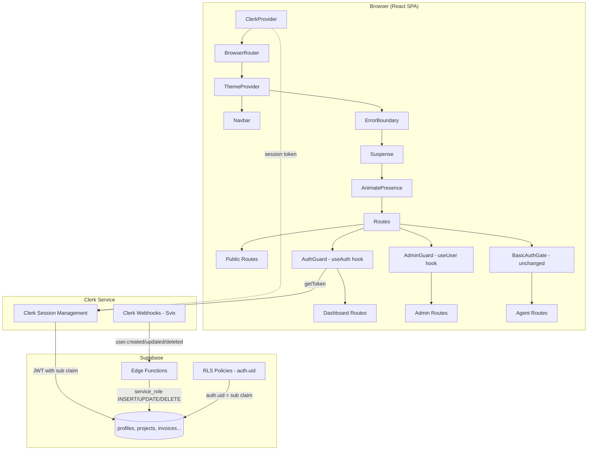

# Design Document: Clerk Auth Migration

## Overview

This design replaces the custom Supabase Auth integration (Google OAuth, email/password, singleton auth store, inactivity timeout, profile upsert) with Clerk's managed authentication service. The migration preserves the existing route protection model, component hierarchy, and Supabase database access patterns while eliminating ~200 lines of custom auth state management code.

**Key architectural decisions:**

1. **ClerkProvider wraps above BrowserRouter** — Provides auth context to the entire app tree including route-level guards.
2. **Clerk's third-party auth (TPA) integration with Supabase** — Uses Clerk as a Supabase third-party auth provider (released March 2025), eliminating the need for custom JWT templates. Clerk session tokens are accepted directly by Supabase when TPA is configured.
3. **Webhook-driven profile sync** — A new Supabase Edge Function receives Clerk `user.*` events and maintains the `profiles` table, replacing the client-side `upsertProfile` pattern.
4. **Minimal route changes** — AuthGuard and AdminGuard are refactored in-place to use Clerk hooks. No route paths or component hierarchy changes.
5. **Profiles table ID migration** — The `profiles.id` column type changes from `uuid` (Supabase Auth) to `text` (Clerk user IDs are `user_*` strings), requiring a data migration and FK cascade updates.

**Research findings:**

- Clerk's Supabase TPA integration (March 2025) allows Supabase to accept Clerk-signed session tokens natively, with `auth.uid()` resolving to the Clerk user ID from the `sub` claim. ([Source: clerk.com/changelog](https://clerk.com/changelog/2025-03-31-supabase-integration), [Source: supabase.com/docs](https://www.supabase.com/docs/guides/auth/third-party/clerk))
- Clerk webhooks use Svix for signature verification. The `svix` npm package provides a `Webhook` class with a `.verify()` method that validates the `svix-id`, `svix-timestamp`, and `svix-signature` headers. ([Source: svix.com](https://www.svix.com/blog/receive-webhooks-with-supabase-edge-functions/))
- Clerk's `useAuth()` hook exposes `isLoaded`, `isSignedIn`, `userId`, `getToken()`, and `signOut()`. The `useUser()` hook provides `user.fullName`, `user.primaryEmailAddress`, `user.imageUrl`, and `user.publicMetadata`. ([Source: clerk.com/docs](https://clerk.com/docs/react/hooks/use-auth))

## Architecture



### Component Hierarchy (Post-Migration)

```
<ClerkProvider publishableKey={...}>        ← NEW: wraps entire app
  <BrowserRouter>
    <App>
      <ThemeProvider>                        ← PRESERVED
        <Navbar />                           ← PRESERVED (uses useUser for avatar)
        <ErrorBoundary>                      ← PRESERVED
          <Suspense>                         ← PRESERVED
            <AnimatePresence>                ← PRESERVED
              <Routes>                       ← PRESERVED (all paths unchanged)
                <AuthGuard>                  ← REFACTORED: useAuth() from @clerk/clerk-react
                <AdminGuard>                 ← REFACTORED: useUser() publicMetadata.role
                <BasicAuthGate>              ← UNCHANGED
              </Routes>
            </AnimatePresence>
          </Suspense>
        </ErrorBoundary>
        <Footer />                           ← PRESERVED
      </ThemeProvider>
    </App>
  </BrowserRouter>
</ClerkProvider>
```

### Entry Point Change (main.jsx)

The `ClerkProvider` must wrap `BrowserRouter` so that Clerk context is available to all route components. A missing publishable key renders a full-page error instead of crashing.

```jsx
// src/main.jsx (post-migration)
import { ClerkProvider } from "@clerk/clerk-react";
import { BrowserRouter } from "react-router-dom";

const clerkPubKey = import.meta.env.VITE_CLERK_PUBLISHABLE_KEY;

if (!clerkPubKey) {
  // Render error UI — no ClerkProvider, no routes
  root.render(<MissingClerkKeyError />);
} else {
  root.render(
    <ClerkProvider publishableKey={clerkPubKey}>
      <BrowserRouter>
        <App />
      </BrowserRouter>
    </ClerkProvider>
  );
}
```

## Components and Interfaces

### 1. AuthGuard (Refactored)

**File:** `src/components/AuthGuard.jsx`

Replaces the custom `useAuth` hook with Clerk's `useAuth` from `@clerk/clerk-react`.

```jsx
import { Navigate } from "react-router-dom";
import { useAuth } from "@clerk/clerk-react";

export default function AuthGuard({ children }) {
  const { isLoaded, isSignedIn } = useAuth();

  if (!isLoaded) {
    return (
      <div className="auth-guard-loading" role="status" aria-label="Loading">
        <div className="auth-guard-spinner" />
        <p>Loading…</p>
      </div>
    );
  }

  if (!isSignedIn) {
    return <Navigate to="/login" replace />;
  }

  return children;
}
```

**Interface:** `{ children: ReactNode } → ReactElement`

### 2. AdminGuard (Refactored)

**File:** `src/components/AdminGuard.jsx`

Uses `useAuth` for authentication state and `useUser` for role metadata.

```jsx
import { Navigate } from "react-router-dom";
import { useAuth, useUser } from "@clerk/clerk-react";

export default function AdminGuard({ children }) {
  const { isLoaded, isSignedIn } = useAuth();
  const { user } = useUser();

  if (!isLoaded) {
    return (
      <div className="auth-guard-loading" role="status" aria-label="Loading">
        <div className="auth-guard-spinner" />
        <p>Loading…</p>
      </div>
    );
  }

  if (!isSignedIn) {
    return <Navigate to="/login" replace />;
  }

  if (user?.publicMetadata?.role !== "admin") {
    return <Navigate to="/dashboard" replace />;
  }

  return children;
}
```

### 3. SignInPage (New)

**File:** `src/pages/SignInPage.jsx`

Replaces the custom `LoginPage` with Clerk's `<SignIn>` component. Handles the `selectedTier` sessionStorage redirect.

```jsx
import { SignIn, useAuth } from "@clerk/clerk-react";
import { Navigate } from "react-router-dom";

export default function SignInPage() {
  const { isLoaded, isSignedIn } = useAuth();

  if (!isLoaded) {
    return <LoadingIndicator />;
  }

  if (isSignedIn) {
    const selectedTier = sessionStorage.getItem("selectedTier");
    if (selectedTier) {
      sessionStorage.removeItem("selectedTier");
      return <Navigate to={`/dashboard/intake/${selectedTier}`} replace />;
    }
    return <Navigate to="/dashboard" replace />;
  }

  return (
    <div className="container">
      <SignIn
        routing="path"
        path="/login"
        signUpUrl="/signup"
        forceRedirectUrl="/dashboard"
      />
    </div>
  );
}
```

### 4. SignUpPage (New)

**File:** `src/pages/SignUpPage.jsx`

```jsx
import { SignUp } from "@clerk/clerk-react";

export default function SignUpPage() {
  return (
    <div className="container">
      <SignUp
        routing="path"
        path="/signup"
        signInUrl="/login"
        forceRedirectUrl="/dashboard"
      />
    </div>
  );
}
```

### 5. useSupabaseClient Hook (New)

**File:** `src/hooks/useSupabaseClient.js`

Provides an authenticated Supabase client using Clerk's session token for RLS.

```jsx
import { useAuth } from "@clerk/clerk-react";
import { useMemo } from "react";
import { createClient } from "@supabase/supabase-js";

const supabaseUrl = import.meta.env.VITE_SUPABASE_URL;
const supabaseAnonKey = import.meta.env.VITE_SUPABASE_ANON_KEY;

export function useSupabaseClient() {
  const { getToken } = useAuth();

  const client = useMemo(() => {
    return createClient(supabaseUrl, supabaseAnonKey, {
      global: {
        headers: async () => {
          const token = await getToken({ template: "supabase" });
          return token
            ? { Authorization: `Bearer ${token}` }
            : {};
        },
      },
    });
  }, [getToken]);

  return client;
}
```

**Note:** If using Clerk's native Supabase TPA integration (March 2025), the `template` parameter may be omitted and Clerk's default session token is accepted directly. The JWT template approach is the fallback for projects not yet on TPA.

### 6. Supabase Client (Refactored)

**File:** `src/lib/supabase.js`

Simplified to a plain anonymous client for non-authenticated operations (storage, realtime, public queries). The `SIGNED_OUT_KEY` logic, auth proxy, and `sb-` localStorage cleanup are removed.

```jsx
import { createClient } from "@supabase/supabase-js";

const supabaseUrl = import.meta.env.VITE_SUPABASE_URL;
const supabaseAnonKey = import.meta.env.VITE_SUPABASE_ANON_KEY;

export const supabase =
  supabaseUrl && supabaseAnonKey
    ? createClient(supabaseUrl, supabaseAnonKey)
    : null;
```

### 7. Clerk Webhook Edge Function (New)

**File:** `supabase/functions/clerk-webhook/index.ts`

Handles `user.created`, `user.updated`, `user.deleted` events. Verifies Svix signature. Uses service role key for database writes.

```typescript
import { serve } from "https://deno.land/std@0.177.0/http/server.ts";
import { createClient } from "https://esm.sh/@supabase/supabase-js@2";
import { Webhook } from "https://esm.sh/svix@1";

serve(async (req: Request) => {
  const webhookSecret = Deno.env.get("CLERK_WEBHOOK_SECRET");
  if (!webhookSecret) {
    return new Response(JSON.stringify({ error: "Missing webhook secret" }), { status: 500 });
  }

  const body = await req.text();
  const headers = {
    "svix-id": req.headers.get("svix-id") ?? "",
    "svix-timestamp": req.headers.get("svix-timestamp") ?? "",
    "svix-signature": req.headers.get("svix-signature") ?? "",
  };

  // Verify signature
  const wh = new Webhook(webhookSecret);
  let event;
  try {
    event = wh.verify(body, headers);
  } catch {
    return new Response(JSON.stringify({ error: "Invalid signature" }), { status: 401 });
  }

  const supabase = createClient(
    Deno.env.get("SUPABASE_URL")!,
    Deno.env.get("SUPABASE_SERVICE_ROLE_KEY")!
  );

  const { type, data } = event;

  switch (type) {
    case "user.created":
    case "user.updated": {
      const { error } = await supabase.from("profiles").upsert({
        id: data.id,
        email: data.email_addresses?.[0]?.email_address ?? "",
        display_name: [data.first_name, data.last_name].filter(Boolean).join(" "),
        avatar_url: data.image_url ?? "",
      }, { onConflict: "id" });
      if (error) return new Response(JSON.stringify({ error: error.message }), { status: 500 });
      break;
    }
    case "user.deleted": {
      // Only delete if row exists; no-op otherwise
      await supabase.from("profiles").delete().eq("id", data.id);
      break;
    }
  }

  return new Response(JSON.stringify({ received: true }), { status: 200 });
});
```

### 8. Sign-Out Handler

Sign-out is handled inline in the Navbar component using Clerk's `useClerk` hook:

```jsx
import { useClerk } from "@clerk/clerk-react";

function Navbar() {
  const { signOut } = useClerk();

  const handleSignOut = async () => {
    setSigningOut(true);
    try {
      // Clear app-specific session keys
      sessionStorage.removeItem("selectedTier");
      sessionStorage.removeItem("agent_auth");
      await signOut();
      window.location.replace("/");
    } catch (err) {
      setSignOutError("Sign-out failed. Please try again.");
      setSigningOut(false);
    }
  };
}
```

## Data Models

### Profiles Table (Modified)

The `profiles.id` column changes from `uuid REFERENCES auth.users(id)` to `text PRIMARY KEY` to accommodate Clerk's `user_*` string IDs.

**Before:**
```sql
CREATE TABLE profiles (
  id uuid PRIMARY KEY REFERENCES auth.users (id) ON DELETE CASCADE,
  ...
);
```

**After:**
```sql
CREATE TABLE profiles (
  id text PRIMARY KEY,  -- Clerk user ID (e.g., "user_2abc123...")
  email text NOT NULL,
  display_name text,
  avatar_url text,
  role text NOT NULL DEFAULT 'client' CHECK (role IN ('client', 'admin')),
  notification_preferences jsonb DEFAULT '{}'::jsonb,
  created_at timestamptz NOT NULL DEFAULT now()
);
```

### Migration SQL (004_clerk_migration.sql)

```sql
-- 004_clerk_migration.sql
-- Migrate profiles.id from Supabase Auth UUID to Clerk user ID (text)

-- Step 1: Drop FK constraint from auth.users
ALTER TABLE profiles DROP CONSTRAINT profiles_pkey CASCADE;

-- Step 2: Change column type
ALTER TABLE profiles ALTER COLUMN id TYPE text;

-- Step 3: Re-add primary key
ALTER TABLE profiles ADD PRIMARY KEY (id);

-- Step 4: Update FK columns in dependent tables
ALTER TABLE projects ALTER COLUMN client_id TYPE text;
ALTER TABLE project_status_history ALTER COLUMN changed_by TYPE text;
ALTER TABLE project_feedback ALTER COLUMN client_id TYPE text;
ALTER TABLE invoices ALTER COLUMN client_id TYPE text;
ALTER TABLE messages ALTER COLUMN sender_id TYPE text;
ALTER TABLE notification_preferences ALTER COLUMN client_id TYPE text;

-- Step 5: Re-add FK constraints
ALTER TABLE projects ADD CONSTRAINT projects_client_id_fkey
  FOREIGN KEY (client_id) REFERENCES profiles(id) ON DELETE CASCADE;
ALTER TABLE project_status_history ADD CONSTRAINT psh_changed_by_fkey
  FOREIGN KEY (changed_by) REFERENCES profiles(id) ON DELETE SET NULL;
ALTER TABLE project_feedback ADD CONSTRAINT pf_client_id_fkey
  FOREIGN KEY (client_id) REFERENCES profiles(id) ON DELETE CASCADE;
ALTER TABLE invoices ADD CONSTRAINT invoices_client_id_fkey
  FOREIGN KEY (client_id) REFERENCES profiles(id) ON DELETE CASCADE;
ALTER TABLE messages ADD CONSTRAINT messages_sender_id_fkey
  FOREIGN KEY (sender_id) REFERENCES profiles(id) ON DELETE CASCADE;
ALTER TABLE notification_preferences ADD CONSTRAINT np_client_id_fkey
  FOREIGN KEY (client_id) REFERENCES profiles(id) ON DELETE CASCADE;
```

### User ID Migration Strategy

For existing users, a one-time migration script maps Supabase Auth UUIDs to Clerk user IDs:

1. **Export existing users** from Supabase Auth (email → UUID mapping)
2. **Import users into Clerk** via Clerk's Backend API `createUser()` — each imported user gets a Clerk `user_*` ID
3. **Build mapping table**: `{ supabase_uuid → clerk_user_id }`
4. **Run UPDATE statements** on `profiles` and all FK columns using the mapping
5. **Verify** all FK relationships resolve correctly

This is a one-time operational task performed during a maintenance window.

### RLS Policy Compatibility

The existing RLS policies use `auth.uid()` which, with Clerk TPA configured, resolves to the `sub` claim from the Clerk JWT — which is the Clerk user ID. Since the `profiles.id` column now stores Clerk user IDs, all policies like `id = auth.uid()` and `client_id = auth.uid()` continue to work without modification.

### Environment Variables

| Variable | Scope | Purpose |
|----------|-------|---------|
| `VITE_CLERK_PUBLISHABLE_KEY` | Client (Vite) | ClerkProvider initialization |
| `CLERK_WEBHOOK_SECRET` | Server (Supabase secrets) | Svix signature verification |
| `VITE_SUPABASE_URL` | Client (Vite) | Supabase client (retained) |
| `VITE_SUPABASE_ANON_KEY` | Client (Vite) | Supabase client (retained) |
| `VITE_STRIPE_PUBLISHABLE_KEY` | Client (Vite) | Stripe (unchanged) |
| `VITE_AGENT_PASSPHRASE` | Client (Vite) | Agent console (unchanged) |

### CSP Additions (netlify.toml)

Added to the global `/*` header block:

| Directive | Added Sources |
|-----------|--------------|
| `script-src` | `https://*.clerk.accounts.dev https://clerk.adamsverse.com` |
| `connect-src` | `https://*.clerk.accounts.dev https://clerk.adamsverse.com` |
| `frame-src` | `https://*.clerk.accounts.dev` |
| `img-src` | `https://img.clerk.com` |
| `style-src` | `https://*.clerk.accounts.dev` |


## Correctness Properties

*A property is a characteristic or behavior that should hold true across all valid executions of a system — essentially, a formal statement about what the system should do. Properties serve as the bridge between human-readable specifications and machine-verifiable correctness guarantees.*

### Property 1: AuthGuard renders correct output for any auth state

*For any* combination of `isLoaded` (boolean) and `isSignedIn` (boolean) values, AuthGuard SHALL:
- Render a loading indicator with `role="status"` when `isLoaded` is false (regardless of `isSignedIn`)
- Render a `<Navigate to="/login" replace />` when `isLoaded` is true and `isSignedIn` is false
- Render the child component when `isLoaded` is true and `isSignedIn` is true

**Validates: Requirements 4.1, 4.2, 4.3**

### Property 2: AdminGuard renders correct output for any user state

*For any* combination of `isLoaded` (boolean), `isSignedIn` (boolean), and `publicMetadata.role` (string or undefined), AdminGuard SHALL:
- Render a loading indicator when `isLoaded` is false
- Redirect to `/login` when `isLoaded` is true and `isSignedIn` is false
- Redirect to `/dashboard` when `isLoaded` is true, `isSignedIn` is true, and `role !== "admin"`
- Render the child component only when `isLoaded` is true, `isSignedIn` is true, and `role === "admin"`

**Validates: Requirements 5.1, 5.2, 5.3**

### Property 3: SignInPage selectedTier redirect path construction

*For any* non-empty string `tierId` stored in sessionStorage under the key `selectedTier`, when the user is authenticated (`isSignedIn` is true), the SignInPage SHALL redirect to exactly `/dashboard/intake/${tierId}` and remove the `selectedTier` key from sessionStorage.

**Validates: Requirements 2.5**

### Property 4: Sign-out clears application sessionStorage keys

*For any* set of application-specific sessionStorage keys (`selectedTier`, `agent_auth`), after a successful sign-out operation, all of those keys SHALL be removed from sessionStorage.

**Validates: Requirements 6.3**

### Property 5: Webhook profile sync preserves user data

*For any* valid Clerk `user.created` or `user.updated` webhook event payload containing an `id`, `email_addresses` array, `first_name`, `last_name`, and `image_url`, the webhook handler SHALL upsert a profiles row where:
- `profiles.id` equals `data.id`
- `profiles.email` equals the first email address
- `profiles.display_name` equals the concatenation of first_name and last_name
- `profiles.avatar_url` equals `data.image_url`

This includes the case where the user ID already exists (idempotent upsert).

**Validates: Requirements 8.1, 8.2, 8.6, 17.1**

### Property 6: Webhook rejects requests with invalid signatures

*For any* request body and set of HTTP headers where the Svix signature does not match the expected HMAC of the body using `CLERK_WEBHOOK_SECRET`, the webhook handler SHALL return HTTP 401 and SHALL NOT modify the profiles table.

**Validates: Requirements 8.4, 8.5**

### Property 7: Webhook graceful no-op for non-existent profiles

*For any* `user.updated` or `user.deleted` webhook event referencing a user ID that does not exist in the profiles table, the webhook handler SHALL return HTTP 200 and take no further action (no error, no row creation).

**Validates: Requirements 8.8**

### Property 8: Admin role derivation from publicMetadata

*For any* value of `user.publicMetadata.role`, the `isAdmin` derivation SHALL be `true` if and only if `user.publicMetadata.role === "admin"`. All other values (undefined, null, "client", empty string, arbitrary strings) SHALL result in `isAdmin` being `false`.

**Validates: Requirements 13.4, 13.5**

### Property 9: Supabase client token inclusion based on auth state

*For any* authenticated user where `getToken({ template: "supabase" })` returns a non-null string, the Supabase client returned by `useSupabaseClient` SHALL include that token as a Bearer Authorization header. *For any* unauthenticated state where `getToken` returns null, the client SHALL NOT include an Authorization header (falling back to anon key access).

**Validates: Requirements 14.2, 14.4, 14.5**

### Property 10: BasicAuthGate passphrase validation

*For any* input string, BasicAuthGate SHALL grant access (render children and set `sessionStorage.agent_auth = "true"`) if and only if the input exactly equals the value of `VITE_AGENT_PASSPHRASE` (or the hardcoded default `"adverse2025"` when the env var is unset). All other inputs SHALL be rejected.

**Validates: Requirements 12.1, 12.4, 12.5**

## Error Handling

### Client-Side Errors

| Scenario | Handling |
|----------|----------|
| Missing `VITE_CLERK_PUBLISHABLE_KEY` | Full-page error component rendered instead of app tree. No crash, no blank screen. |
| Clerk session token refresh failure | `isSignedIn` becomes `false` → AuthGuard redirects to `/login`. No custom error UI needed. |
| Sign-out failure | Try-catch around `signOut()` → display inline error message, keep user on current page, re-enable button. |
| Supabase query with expired/missing token | Falls back to anon key → RLS restricts to public data. No crash. Components should handle empty results gracefully. |
| Network error during Supabase query | Existing error handling in service modules (`{ success: false, error: message }` pattern) remains unchanged. |

### Server-Side Errors (Webhook)

| Scenario | Response | Side Effect |
|----------|----------|-------------|
| Missing `CLERK_WEBHOOK_SECRET` env var | 500 | No event processing |
| Invalid Svix signature | 401 | No database modification |
| Supabase write failure (insert/update/delete) | 500 | Event not acknowledged — Clerk will retry |
| Non-existent user ID on update/delete | 200 | No-op (graceful) |
| Malformed event payload (missing fields) | 500 | No database modification |
| Duplicate user.created (idempotent) | 200 | Upsert updates existing row |

### Error Boundaries

The existing `<ErrorBoundary>` component in the component hierarchy catches render errors from any route component, including the new Clerk-powered guards. No changes needed to ErrorBoundary itself.

## Testing Strategy

### Property-Based Tests (fast-check)

Each correctness property maps to a property-based test file using fast-check with minimum 100 iterations.

| Property | Test File | Generator Strategy |
|----------|-----------|-------------------|
| 1: AuthGuard state machine | `property-clerk-auth-guard.test.jsx` | `fc.record({ isLoaded: fc.boolean(), isSignedIn: fc.boolean() })` |
| 2: AdminGuard state machine | `property-clerk-admin-guard.test.jsx` | `fc.record({ isLoaded: fc.boolean(), isSignedIn: fc.boolean(), role: fc.oneof(fc.constant("admin"), fc.constant("client"), fc.constant(undefined), fc.string()) })` |
| 3: selectedTier redirect | `property-clerk-signin-redirect.test.jsx` | `fc.string({ minLength: 1 }).filter(s => s.trim().length > 0)` for tier IDs |
| 4: Sign-out cleanup | `property-clerk-signout.test.js` | `fc.array(fc.constantFrom("selectedTier", "agent_auth", "other_key"))` |
| 5: Webhook profile sync | `property-clerk-webhook-sync.test.js` | `fc.record({ id: fc.string(), email: fc.emailAddress(), firstName: fc.string(), lastName: fc.string(), imageUrl: fc.webUrl() })` |
| 6: Webhook signature rejection | `property-clerk-webhook-signature.test.js` | `fc.record({ body: fc.string(), signature: fc.string() })` for invalid signatures |
| 7: Webhook no-op for missing profiles | `property-clerk-webhook-noop.test.js` | `fc.string()` for non-existent user IDs |
| 8: Admin role derivation | `property-clerk-admin-role.test.js` | `fc.oneof(fc.constant("admin"), fc.constant("client"), fc.constant(undefined), fc.constant(null), fc.constant(""), fc.string())` |
| 9: Supabase client token | `property-clerk-supabase-client.test.js` | `fc.option(fc.string({ minLength: 10 }))` for token presence |
| 10: BasicAuthGate passphrase | `property-clerk-basic-auth-gate.test.jsx` | `fc.string()` for arbitrary inputs |

### Unit Tests (Example-Based)

| Test | File | What It Verifies |
|------|------|-----------------|
| Missing env var renders error | `clerk-provider-setup.test.jsx` | Requirement 1.3, 1.4 |
| SignInPage renders Clerk SignIn | `clerk-signin-page.test.jsx` | Requirement 2.1 |
| SignUpPage renders Clerk SignUp | `clerk-signup-page.test.jsx` | Requirement 3.1 |
| Sign-out calls signOut() | `clerk-signout.test.jsx` | Requirement 6.1, 6.2 |
| Sign-out error handling | `clerk-signout.test.jsx` | Requirement 6.4, 6.5 |
| Webhook returns 500 when secret missing | `clerk-webhook.test.js` | Requirement 10.2 |
| Webhook returns 500 on DB error | `clerk-webhook.test.js` | Requirement 8.7 |

### Smoke Tests

| Check | Method |
|-------|--------|
| Build succeeds after migration | `npm run build` (CI) |
| No imports of removed `useAuth` hook | grep/lint rule |
| No `supabase.auth` references | grep/lint rule |
| CSP includes Clerk domains | netlify.toml parse check |
| BasicAuthGate has no @clerk imports | grep check |
| All existing non-auth tests pass | `npm run test` |

### Mocking Strategy

```javascript
// Mock pattern for Clerk hooks in tests
vi.mock("@clerk/clerk-react", () => ({
  useAuth: () => ({ isLoaded: true, isSignedIn: true, getToken: vi.fn() }),
  useUser: () => ({ user: { publicMetadata: { role: "client" } } }),
  useClerk: () => ({ signOut: vi.fn() }),
  ClerkProvider: ({ children }) => children,
  SignIn: () => <div data-testid="clerk-sign-in" />,
  SignUp: () => <div data-testid="clerk-sign-up" />,
}));
```

### Test Configuration

- **Runner:** Vitest 4 with jsdom environment
- **PBT Library:** fast-check 4
- **Minimum iterations:** 100 per property test
- **Tag format:** `Feature: clerk-auth-migration, Property {N}: {title}`
- **Test location:** `src/__tests__/property-clerk-*.test.{js,jsx}` for property tests, `src/__tests__/clerk-*.test.{js,jsx}` for unit tests
