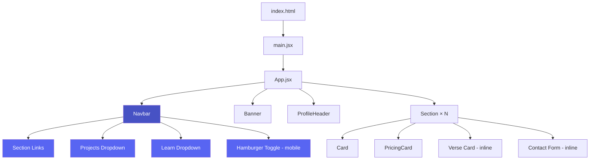

# Design Document: Consistent Styling & Navigation

## Overview

This feature consolidates the AdamsVerse site's visual system and adds navigation. Three things happen:

1. **Design Token System** — Extend the existing `:root` CSS custom properties in `styles.css` with a complete token set (spacing scale, typography, colors, radii, shadows, transitions). Replace all hardcoded values with token references.
2. **Responsive Navigation Menu** — A new `Navbar` component with section links, a Projects dropdown (data-driven), and a Learn dropdown. Horizontal bar on desktop (>600px), hamburger overlay on mobile (≤600px). Fixed to top, always visible on scroll.
3. **Cleanup** — Remove unused `EmailForm.jsx` and `ContactSection.jsx`, fix `class` → `className` in JSX, eliminate inline styles.

The site remains a single-page React + Vite app. No routing changes. No new CSS files. No CSS-in-JS. Everything stays in `styles.css`.

## Architecture



### Key Decisions

- **Single CSS file** — All tokens and component styles stay in `styles.css`. No CSS modules, no Tailwind usage, no styled-components. The existing `@fortawesome` import and custom properties pattern continues.
- **No new dependencies** — The navbar is pure React state (useState for mobile toggle and dropdown open/close). No headless UI library needed for this scope.
- **Data-driven Projects dropdown** — Project entries live in a `const PROJECTS` array inside `Navbar.jsx` (or a separate `data/projects.js` if preferred). Each entry is `{ name, url }`. Adding a project = appending to the array.
- **Smooth scroll via IDs** — Each `Section` gets an `id` prop. Nav links use `href="#section-id"` with `scroll-behavior: smooth` on `html`. No scroll library needed.
- **Fixed navbar with body offset** — Navbar is `position: fixed; top: 0`. Body gets `padding-top` equal to navbar height to prevent content overlap.

## Components and Interfaces

### New: `Navbar.jsx`

```jsx
// Props: none (self-contained)
// State:
//   mobileOpen: boolean — hamburger menu toggle
//   projectsOpen: boolean — Projects dropdown toggle
//   learnOpen: boolean — Learn dropdown toggle

// Data:
const PROJECTS = [
  { name: "Portfolio", url: "https://adam-abdul.com/" },
  // ... add more entries here
];

const SECTIONS = [
  { label: "Pricing", id: "pricing" },
  { label: "Discord", id: "discord" },
  { label: "Content & Socials", id: "content-socials" },
  { label: "Support", id: "support" },
  { label: "Contact Me", id: "contact" },
];

const LEARN_LINKS = [
  { label: "DSA Guide", href: "/dsa.html" },
  { label: "LeetCode Guide", href: "/leetcode.html" },
];
```

**Behavior:**
- Desktop (>600px): Horizontal bar, dropdowns open on hover/click
- Mobile (≤600px): Hamburger icon toggles vertical overlay. Dropdowns are expandable accordion groups inside the overlay.
- Clicking a section link smooth-scrolls and closes mobile overlay.
- Clicking a project link opens in new tab (`target="_blank"`).
- Clicking a Learn link navigates to the HTML page.

### Modified: `Section.jsx`

Add `id` prop for scroll targeting:

```jsx
export default function Section({ title, id, children }) {
  return (
    <section className="section" id={id}>
      <div className="section-title">{title}</div>
      <div className="grid-container">{children}</div>
    </section>
  );
}
```

Changes: wraps in `<section>` instead of fragment, accepts `id`.

### Modified: `App.jsx`

- Import and render `<Navbar />` at top of container
- Pass `id` props to each `<Section>`
- Remove inline `style` attributes (move to CSS classes)
- Fix `class` → `className` on Discord link
- Remove `EmailForm` and `ContactSection` imports if present
- Remove the standalone "Development" section (replaced by Projects dropdown in nav)

### Removed: `EmailForm.jsx`, `ContactSection.jsx`

Neither is imported by `App.jsx` (the contact form is inline in App). These are dead files.

## Data Models

### Project Entry

```ts
type ProjectEntry = {
  name: string;  // Display name, e.g. "Portfolio"
  url: string;   // External URL, opens in new tab
};
```

### Section Link

```ts
type SectionLink = {
  label: string;  // Display text in nav
  id: string;     // Matches the section's DOM id for scroll targeting
};
```

### Learn Link

```ts
type LearnLink = {
  label: string;  // Display text, e.g. "DSA Guide"
  href: string;   // Path to standalone HTML page, e.g. "/dsa.html"
};
```

### Design Tokens (CSS Custom Properties)

Extended `:root` block in `styles.css`:

```css
:root {
  /* === Spacing Scale === */
  --space-1: 4px;
  --space-2: 8px;
  --space-3: 12px;
  --space-4: 16px;
  --space-6: 24px;
  --space-8: 32px;
  --space-12: 48px;

  /* === Typography === */
  --font-family: 'Inter', sans-serif;
  --font-size-xs: 0.75rem;
  --font-size-sm: 0.875rem;
  --font-size-base: 1rem;
  --font-size-lg: 1.1rem;
  --font-size-xl: 1.4rem;
  --font-size-2xl: 1.9rem;
  --font-size-3xl: 2.2rem;
  --font-weight-normal: 400;
  --font-weight-medium: 500;
  --font-weight-semibold: 600;
  --font-weight-bold: 700;
  --line-height-tight: 1.2;
  --line-height-normal: 1.5;
  --line-height-relaxed: 1.6;

  /* === Colors (existing + consolidated) === */
  --bg-gradient-start: #1c1e5a;
  --bg-gradient-end: #2e3192;
  --card-bg: rgba(255, 255, 255, 0.08);
  --card-hover: rgba(255, 255, 255, 0.2);
  --badge-bg: rgba(0, 0, 0, 0.25);
  --text-color: #ffffff;
  --text-muted: rgba(255, 255, 255, 0.6);
  --border-light: rgba(255, 255, 255, 0.05);
  --border-hover: rgba(255, 255, 255, 0.25);
  --accent-primary: #5865f2;
  --accent-primary-dark: #4752c4;
  --success-color: lightgreen;
  --error-color: red;

  /* === Border Radii === */
  --radius-sm: 4px;
  --radius-md: 12px;
  --radius-lg: 16px;
  --radius-xl: 22px;
  --radius-full: 999px;

  /* === Shadows === */
  --shadow-sm: 0 2px 4px rgba(0, 0, 0, 0.15);
  --shadow-md: 0 4px 20px rgba(0, 0, 0, 0.15);
  --shadow-lg: 0 6px 18px rgba(88, 101, 242, 0.45);

  /* === Transitions === */
  --transition-fast: 0.2s ease;
  --transition-normal: 0.25s ease;
  --transition-slow: 0.3s ease;

  /* === Layout === */
  --container-max-width: 520px;
  --container-max-width-lg: 720px;
  --container-padding: 12px;
  --container-padding-lg: 24px;
  --navbar-height: 56px;

  /* (existing icon colors remain unchanged) */
}
```

### Navbar CSS Structure

Key classes added to `styles.css`:

| Class | Purpose |
|---|---|
| `.navbar` | Fixed top bar, full width, glass background |
| `.navbar-inner` | Max-width container inside navbar |
| `.navbar-brand` | Logo/site name on the left |
| `.navbar-links` | Horizontal link list (desktop) |
| `.navbar-dropdown` | Dropdown wrapper (Projects, Learn) |
| `.navbar-dropdown-menu` | Dropdown content panel |
| `.navbar-hamburger` | Hamburger icon button (mobile only) |
| `.navbar-overlay` | Full-screen mobile menu overlay |
| `.navbar-overlay-group` | Expandable accordion group in overlay |


## Correctness Properties

*A property is a characteristic or behavior that should hold true across all valid executions of a system — essentially, a formal statement about what the system should do. Properties serve as the bridge between human-readable specifications and machine-verifiable correctness guarantees.*

### Property 1: CSS token usage — no hardcoded values

*For any* CSS rule in `styles.css` (outside the `:root` block), spacing values (px), color values (hex, rgba, rgb), font-size values, border-radius values, box-shadow values, and transition-duration values should reference a `var(--token)` custom property rather than a hardcoded literal.

**Validates: Requirements 1.2, 3.1, 5.1**

### Property 2: Data-driven project rendering

*For any* entry in the PROJECTS data array with a `name` and `url`, the rendered Projects dropdown should contain an element displaying that project's name and linking to that project's URL.

**Validates: Requirements 2.3, 2.4**

### Property 3: Project links open in new tab

*For any* project entry link rendered in the Projects dropdown, the anchor element should have `target="_blank"` and `rel="noopener noreferrer"` attributes.

**Validates: Requirements 2.5**

### Property 4: Nav section links match section IDs

*For any* section link in the navigation menu, the link's `href` value should be `#<id>` where `<id>` matches the `id` attribute of the corresponding `<section>` element in the DOM.

**Validates: Requirements 2.7**

### Property 5: Mobile overlay closes on link click

*For any* link inside the mobile navigation overlay, clicking it should result in the overlay being closed (mobileOpen state set to false).

**Validates: Requirements 2.12**

### Property 6: JSX markup correctness

*For any* JSX element across all component files, the element should not contain inline `style` attributes, and should use `className` instead of `class` for CSS class assignment.

**Validates: Requirements 3.2, 6.2**

### Property 7: No orphaned component files

*For any* file in the `src/components/` directory, there should exist at least one import statement in another source file that references it.

**Validates: Requirements 6.3**

## Error Handling

| Scenario | Handling |
|---|---|
| PROJECTS array is empty | Projects dropdown renders but shows "No projects yet" placeholder text |
| Section ID mismatch (nav link points to non-existent ID) | Browser ignores the hash — no crash. Mitigated by using the same SECTIONS constant for both nav links and Section id props |
| EmailJS fails to send | Existing error handling in App.jsx displays error message via `status` state. Move the inline error style to a CSS class (`.form-status-error`, `.form-status-success`) |
| Mobile menu open + window resize to desktop | Add a `useEffect` that listens for resize and closes mobile overlay when viewport exceeds 600px |
| Dropdown open + click outside | Add a click-outside handler (or use `onBlur`) to close open dropdowns |
| Missing Font Awesome icons | Already handled — `@fortawesome/fontawesome-free` is a dependency. Icons degrade to empty space if class name is wrong |

## Testing Strategy

Since this is a fast-delivery personal site, testing is kept lean and practical.

### Manual Testing Checklist

- [ ] Desktop: navbar displays horizontally, dropdowns open on hover/click
- [ ] Mobile (≤600px): hamburger icon visible, overlay toggles, dropdowns expand as accordions
- [ ] All section links smooth-scroll to correct sections
- [ ] Project links open in new tabs
- [ ] Learn links navigate to `/dsa.html` and `/leetcode.html`
- [ ] Mobile overlay closes after clicking a link
- [ ] No inline styles remain in JSX
- [ ] `EmailForm.jsx` and `ContactSection.jsx` are deleted
- [ ] No `class=` attributes in JSX (all `className`)
- [ ] Design tokens are used consistently — spot-check card, section, profile header styles
- [ ] Responsive spacing reduces on mobile
- [ ] Navbar stays fixed on scroll

### Unit Tests (if added later)

Focus areas for lightweight unit tests:
- Navbar renders all expected section links
- Projects dropdown renders entries from data array
- Learn dropdown contains correct hrefs
- Section component renders with correct `id` attribute

### Property-Based Tests (if added later)

If property-based testing is introduced, use `fast-check` as the PBT library. Each test should run minimum 100 iterations.

- **Feature: consistent-styling-navigation, Property 2: Data-driven project rendering** — Generate random project arrays, render dropdown, verify all entries appear
- **Feature: consistent-styling-navigation, Property 4: Nav section links match section IDs** — Generate random section configs, render nav + sections, verify href/id alignment
- **Feature: consistent-styling-navigation, Property 5: Mobile overlay closes on link click** — Generate random link clicks in overlay, verify mobileOpen becomes false

For now, manual testing is sufficient given the scope and delivery timeline.
