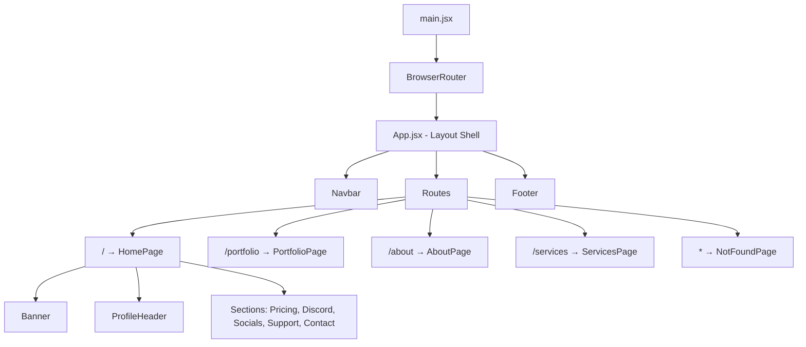

# Design Document: Design Overhaul

## Overview

This design overhaul transforms the AdamsVerse single-page app into a multi-page, visually polished personal brand site. The work spans four areas: resolving duplicate branding (logo replaces navbar text), elevating visual design (glassmorphism cards, scroll animations, enhanced sections), adding routed pages (Portfolio, About, Services, 404), and integrating all image assets purposefully. The existing `styles.css` design token system remains the single source of styling truth — no CSS modules or Tailwind.

The site already has `framer-motion`, `react-router-dom`, `@mui/material`, and FontAwesome installed but largely unused. This feature activates `framer-motion` for scroll animations and `react-router-dom` for page routing.

## Architecture



The architecture shifts from a single monolithic `App.jsx` to a shared layout pattern:

1. `App.jsx` becomes the layout shell — renders `Navbar` and `Footer` persistently, with `<Routes>` in between.
2. Each page is a standalone component in `src/pages/`.
3. `HomePage` extracts the current `App.jsx` body content (Banner through Contact form).
4. New pages (`PortfolioPage`, `AboutPage`, `ServicesPage`, `NotFoundPage`) are data-driven where applicable.
5. A shared `AnimatedSection` wrapper component handles framer-motion `whileInView` animations for all pages.

## Components and Interfaces

### Modified Components

**Navbar** (`src/components/Navbar.jsx`)
- Replace `<a className="navbar-brand">AdamsVerse</a>` with `<Link to="/"></Link>`
- Add `<Link>` entries for Portfolio, About, Services alongside existing section anchors
- Section anchor links (`#pricing`, `#contact`, etc.) use `/#pricing` format so they work from any page
- Mobile overlay updated with the same new links

**ProfileHeader** (`src/components/ProfileHeader.jsx`)
- Add flag images (`usa.png`, `eritrea.png`) inline with the title
- Add animated subtitle using framer-motion (fade-in word-by-word or typewriter effect)
- Add CTA button ("Let's Work Together" → links to `/#contact`)
- Role pills get individual gradient/accent colors
- Wrap in framer-motion `motion.div` with `whileInView` fade-up

**Card** (`src/components/Card.jsx`)
- Wrap in `motion.div` for staggered scroll animation
- Accept an optional `index` prop for stagger delay calculation
- CSS updates: glassmorphism background, colored icons by default, hover scale+glow

**Section** (`src/components/Section.jsx`)
- Wrap in `motion.section` with `whileInView` fade-up animation
- Accept optional `variant` prop for alternating background treatments
- Enhanced title styling (larger, bolder, with accent underline)

**Banner** — no structural changes, just CSS refinements

**PricingCard** — CSS-only changes (gradient border, badge treatment)

### New Components

**Footer** (`src/components/Footer.jsx`)
- Nav links: Home, Portfolio, About, Services (using `<Link>`)
- Social icons row (same icons as Content & Socials section)
- Copyright line: "© 2026 AdamsVerse LLC"
- Distinct darker background with top border

**AnimatedSection** (`src/components/AnimatedSection.jsx`)
- Thin wrapper: `motion.div` with `whileInView`, `viewport={{ once: true, amount: 0.2 }}`
- Props: `children`, `delay` (default 0), `className`
- Reduces animation duration by 50% when viewport ≤ 600px (via a `useReducedMotion` or media query check)

### New Pages

**HomePage** (`src/pages/HomePage.jsx`)
- Extracts current App.jsx body: Banner, ProfileHeader, all Sections, Contact form
- No new logic — just a reorganization

**PortfolioPage** (`src/pages/PortfolioPage.jsx`)
- Imports project data from `src/data/projects.js` (array of `{ title, description, tags[], link?, image? }`)
- Renders a grid of project cards with AnimatedSection wrappers
- Cards open external links in new tabs

**AboutPage** (`src/pages/AboutPage.jsx`)
- Bio section with logo/avatar, name, multi-paragraph bio
- Skills section: array of skill strings rendered as styled pills
- Experience/timeline section: array of `{ year, title, description }`
- Flag images for heritage
- All sections wrapped in AnimatedSection

**ServicesPage** (`src/pages/ServicesPage.jsx`)
- Imports service data from `src/data/services.js` (array of `{ title, description, priceRange, deliverables[] }`)
- Each service card has a CTA button linking to `/#contact`
- Wrapped in AnimatedSection

**NotFoundPage** (`src/pages/NotFoundPage.jsx`)
- Simple centered message: "404 — Page Not Found"
- Link back to Home

### Data Files

**`src/data/projects.js`** — exports an array of project objects
**`src/data/services.js`** — exports an array of service objects

## Data Models

### Project
```js
{
  id: string,
  title: string,
  description: string,
  tags: string[],        // e.g. ["React", "Node.js"]
  link: string | null,   // external URL, optional
  image: string | null   // thumbnail import or URL, optional
}
```

### Service
```js
{
  id: string,
  title: string,
  description: string,
  priceRange: string,    // e.g. "$35–$50/hr"
  deliverables: string[] // e.g. ["Custom design", "Responsive layout"]
}
```

### Skill (simple string array)
```js
["React", "JavaScript", "CSS", "Node.js", "Python", ...]
```

### Experience Entry
```js
{
  year: string,          // e.g. "2024"
  title: string,         // e.g. "Founded AdamsVerse LLC"
  description: string
}
```

## Correctness Properties

*A property is a characteristic or behavior that should hold true across all valid executions of a system — essentially, a formal statement about what the system should do. Properties serve as the bridge between human-readable specifications and machine-verifiable correctness guarantees.*

> **Note:** This feature is being delivered with a fast-delivery focus. Testing sections are included for documentation completeness but are not being implemented in this iteration.

### Property 1: Route-layout consistency

*For all* defined routes (`/`, `/portfolio`, `/about`, `/services`), rendering the route shall produce a page that includes both the Navbar component and the Footer component as persistent layout elements.

**Validates: Requirements 11.1, 11.2, 11.3, 8.5, 9.6, 10.5**

### Property 2: Portfolio card completeness

*For any* project object in the projects data array, the rendered portfolio card shall display the project's title, description, and technology tags list.

**Validates: Requirements 8.2**

### Property 3: Service card completeness

*For any* service object in the services data array, the rendered service card shall display the service's title, description, price range, and list of included deliverables.

**Validates: Requirements 10.2**

### Property 4: Image accessibility

*For any* `` element rendered anywhere in the application, the element shall have a non-empty `alt` attribute providing a descriptive text alternative.

**Validates: Requirements 12.5**

### Property 5: Skills rendering completeness

*For any* skill string in the skills data array, the About page shall render a corresponding styled tag/pill element containing that skill text.

**Validates: Requirements 9.3**

## Error Handling

- **404 route**: Any undefined URL path renders `NotFoundPage` with a link back to `/`
- **Missing project link**: Portfolio cards without a `link` value render without click-through behavior (no broken `<a>` tags)
- **Missing project image**: Cards without an `image` value render a fallback gradient or icon placeholder
- **Contact form errors**: Error messages render with an icon prefix and styled container (existing emailjs error handling enhanced with better UI)
- **Image load failures**: `` elements should degrade gracefully (alt text visible, no broken image icons disrupting layout)

## Testing Strategy

Not applicable — fast delivery focus. Testing will be addressed in a future iteration if needed.
