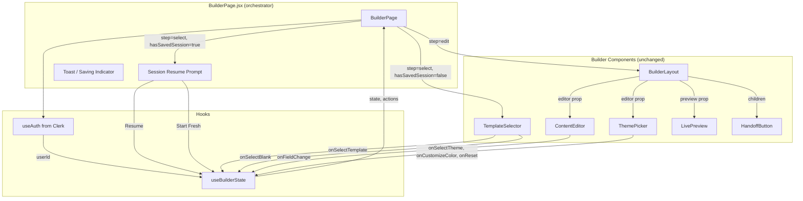

# Design Document: WeBuilder Integration

## Overview

This feature wires the existing `useBuilderState` hook into `BuilderPage.jsx` and connects all builder components (ContentEditor, LivePreview, ThemePicker, HandoffButton, BuilderLayout, TemplateSelector) so the `/builder` route delivers a functional end-to-end website building experience. No new components or hooks are created — this is purely orchestration, prop wiring, and minor fixes to adjacent files (SignUpPage redirect, test mocks).

**Scope:**
- Replace BuilderPage placeholder content with real component wiring
- Add session resume prompt UI (inline in BuilderPage, not a separate component)
- Add toast/saving indicator UI (inline CSS module classes)
- Fix SignUpPage `forceRedirectUrl` to respect `?redirect=` query param
- Update 2 test files with mocks for newly imported modules

## Architecture



**Data Flow:**
1. BuilderPage calls `useBuilderState({ userId })` — single source of truth
2. State determines which UI to show: resume prompt, template selector, or edit layout
3. All child components receive state slices and action callbacks as props — no adapter functions needed
4. BuilderLayout handles responsive split-panel logic internally
5. Persistence (localStorage + Supabase) is handled entirely within useBuilderState

## Components and Interfaces

### BuilderPage (Modified)

```jsx
// src/pages/BuilderPage.jsx
import { useAuth } from "@clerk/clerk-react";
import { motion, AnimatePresence } from "framer-motion";
import { useBuilderState } from "../hooks/useBuilderState";
import BuilderLayout from "../components/builder/BuilderLayout";
import ContentEditor from "../components/builder/ContentEditor";
import LivePreview from "../components/builder/LivePreview";
import ThemePicker from "../components/builder/ThemePicker";
import HandoffButton from "../components/builder/HandoffButton";
import TemplateSelector from "../components/builder/TemplateSelector";
import styles from "./BuilderPage.module.css";

export default function BuilderPage() {
  const { userId } = useAuth();
  const [state, actions] = useBuilderState({ userId });
  // Renders based on state.step and state.hasSavedSession
}
```

**Rendering logic:**
- `state.hasSavedSession && state.step === "select"` → Session Resume Prompt
- `state.step === "select" && !state.hasSavedSession` → TemplateSelector
- `state.step === "edit" && state.config` → BuilderLayout with wired components
- `state.step === "edit" && !state.config` → fallback to TemplateSelector (edge case)

### Session Resume Prompt (Inline in BuilderPage)

Not a separate component file — rendered as a `<motion.section>` block within BuilderPage when `state.hasSavedSession` is true and step is "select".

```jsx
<motion.section
  key="resume"
  className={styles.resumePrompt}
  initial={{ opacity: 0, y: 12 }}
  animate={{ opacity: 1, y: 0 }}
  exit={{ opacity: 0, y: -12 }}
  transition={{ duration: 0.2 }}
>
  <h2>Welcome Back</h2>
  <p>You have a saved session{savedName ? `: ${savedName}` : ""}.</p>
  <button onClick={actions.resumeSession}>Resume</button>
  <button onClick={actions.startFresh}>Start Fresh</button>
</motion.section>
```

The `savedName` is derived by peeking at localStorage (`webuilder_preview_session` → `config.name`).

### Edit Step Layout Wiring

```jsx
<BuilderLayout
  editor={
    <div className={styles.editorScroll}>
      <div className={styles.editorHeader}>
        <button onClick={actions.startFresh}>← Back to Templates</button>
      </div>
      <ContentEditor
        config={state.config}
        onFieldChange={actions.updateField}
        readOnly={false}
      />
      <ThemePicker
        packageSlug={state.packageSlug}
        activeThemeIndex={state.baseThemeIndex}
        customColors={state.customColors}
        onSelectTheme={actions.selectTheme}
        onCustomizeColor={actions.customizeColor}
        onReset={actions.resetTheme}
      />
    </div>
  }
  preview={
    <LivePreview
      config={state.config}
      theme={state.activeTheme}
      layout={undefined}
    />
  }
>
  <HandoffButton
    config={state.config}
    packageName={state.config?.name || "Custom Website"}
    themeLabel={state.activeTheme?.label || ""}
    category={state.category || ""}
  />
</BuilderLayout>
```

**Key decisions:**
- `layout` passed as `undefined` to LivePreview — it derives layout internally from `config.category` via its own `CATEGORY_LAYOUT_MAP`
- Editor content wrapped in `.editorScroll` container with `overflow-y: auto` and `max-height: calc(100vh - 160px)` for independent scrolling
- "Back to Templates" positioned inside the editor panel header, above ContentEditor
- ContentEditor placed above ThemePicker (content editing prioritized)

### Toast and Saving Indicator (Inline in BuilderPage)

```jsx
{/* Toast — shown for storage/save errors */}
{toastMessage && (
  <div className={styles.toast} role="status" aria-live="polite">
    {toastMessage}
  </div>
)}

{/* Saving indicator — shown while saving to Supabase */}
{state.isSavingToSupabase && (
  <span className={styles.savingIndicator}>Saving…</span>
)}
```

Toast logic:
- Displayed when `state.storageAvailable === false` or `state.supabaseSaveError` is set
- Auto-dismisses after 5 seconds via a `useEffect` with `setTimeout`
- Positioned fixed at bottom-center, does not obstruct editor/preview
- State managed with a local `useState` for `toastMessage` and `toastVisible`

### SignUpPage Fix

```jsx
// src/pages/SignUpPage.jsx
import { SignUp } from "@clerk/clerk-react";
import { useSearchParams } from "react-router-dom";

export default function SignUpPage() {
  const [searchParams] = useSearchParams();
  const redirectUrl = searchParams.get("redirect") || "/dashboard";

  return (
    <div className="container">
      <SignUp
        routing="path"
        path="/signup"
        signInUrl="/login"
        forceRedirectUrl={redirectUrl}
      />
    </div>
  );
}
```

## CSS Module Changes

### BuilderPage.module.css Updates

Remove placeholder styles (`.editorPreviewLayout`, `.editorPanel`, `.previewPanel`, `.placeholder`, `.placeholderButton`, `.authInfo`) and add:

```css
/* Session resume prompt */
.resumePrompt {
  display: flex;
  flex-direction: column;
  align-items: center;
  gap: var(--space-4, 1rem);
  padding: var(--space-12, 3rem) var(--space-4, 1rem);
  text-align: center;
}

.resumePrompt h2 {
  font-size: var(--text-xl, 1.25rem);
  color: var(--color-text-primary, #1a1a2e);
}

.resumePrompt p {
  color: var(--color-text-secondary, #64748b);
}

.resumeActions {
  display: flex;
  gap: var(--space-3, 0.75rem);
}

/* Editor scroll container */
.editorScroll {
  overflow-y: auto;
  max-height: calc(100vh - 160px);
  display: flex;
  flex-direction: column;
  gap: var(--space-4, 1rem);
}

.editorHeader {
  display: flex;
  align-items: center;
  padding-bottom: var(--space-3, 0.75rem);
  border-bottom: 1px solid var(--color-border, #e2e8f0);
}

/* Back button */
.backButton {
  font-size: var(--text-sm, 0.875rem);
  color: var(--color-text-secondary, #64748b);
  background: none;
  border: none;
  cursor: pointer;
  padding: var(--space-1, 0.25rem) var(--space-2, 0.5rem);
  border-radius: var(--radius-sm, 4px);
  transition: color 0.15s ease;
}

.backButton:hover {
  color: var(--color-accent, #2563eb);
}

/* Toast */
.toast {
  position: fixed;
  bottom: var(--space-6, 1.5rem);
  left: 50%;
  transform: translateX(-50%);
  background: var(--color-bg-raised, #1e293b);
  color: var(--color-text-inverse, #fff);
  padding: var(--space-3, 0.75rem) var(--space-5, 1.25rem);
  border-radius: var(--radius-md, 8px);
  font-size: var(--text-sm, 0.875rem);
  z-index: var(--z-toast, 700);
  box-shadow: var(--shadow-lg);
  animation: slideUp 0.2s ease;
}

@keyframes slideUp {
  from { opacity: 0; transform: translateX(-50%) translateY(8px); }
  to { opacity: 1; transform: translateX(-50%) translateY(0); }
}

/* Saving indicator */
.savingIndicator {
  position: fixed;
  top: var(--space-3, 0.75rem);
  right: var(--space-4, 1rem);
  font-size: var(--text-xs, 0.75rem);
  color: var(--color-text-muted, #94a3b8);
  z-index: var(--z-sticky, 200);
}
```

## Test Updates

### builder-auth-navbar.test.jsx

Add mocks for all newly imported modules:

```javascript
// Add to existing mocks
vi.mock("../hooks/useBuilderState", () => ({
  useBuilderState: () => [
    {
      step: "select",
      config: null,
      activeTheme: null,
      baseThemeIndex: 0,
      category: null,
      packageSlug: null,
      customColors: null,
      hasSavedSession: false,
      storageAvailable: true,
      isSavingToSupabase: false,
      supabaseSaveError: null,
      isAuthenticated: false,
    },
    {
      selectTemplate: vi.fn(),
      selectBlankTemplate: vi.fn(),
      startFresh: vi.fn(),
      resumeSession: vi.fn(),
      updateField: vi.fn(),
      selectTheme: vi.fn(),
      customizeColor: vi.fn(),
      resetTheme: vi.fn(),
    },
  ],
}));

vi.mock("../hooks/useSupabaseClient", () => ({
  useSupabaseClient: () => null,
}));

vi.mock("../components/builder/BuilderLayout", () => ({
  default: ({ editor, preview, children }) => (
    <div data-testid="builder-layout">{editor}{preview}{children}</div>
  ),
}));

vi.mock("../components/builder/ContentEditor", () => ({
  default: () => <div data-testid="content-editor" />,
}));

vi.mock("../components/builder/LivePreview", () => ({
  default: () => <div data-testid="live-preview" />,
}));

vi.mock("../components/builder/ThemePicker", () => ({
  default: () => <div data-testid="theme-picker" />,
}));

vi.mock("../components/builder/HandoffButton", () => ({
  default: () => <div data-testid="handoff-button" />,
}));
```

The auth-awareness test that checks "Editing as John Doe" will be removed since the new BuilderPage no longer renders inline auth info — the user context is visible through Clerk's own UI and the HandoffButton.

### builder-error-boundary.test.jsx

Same mock additions. The error boundary tests remain unchanged in their assertions (error fallback renders, reload button calls `window.location.reload`). The `shouldThrow` mechanism shifts to throwing inside the `useBuilderState` mock or TemplateSelector mock (same pattern, just needs the additional mocks registered).

## File Changes Summary

| File | Action | Description |
|------|--------|-------------|
| `src/pages/BuilderPage.jsx` | **Rewrite** | Replace placeholder with hook integration + component wiring |
| `src/pages/BuilderPage.module.css` | **Update** | Remove placeholder styles, add resume/toast/scroll styles |
| `src/pages/SignUpPage.jsx` | **Update** | Add `useSearchParams` to read `?redirect=` param |
| `src/__tests__/builder-auth-navbar.test.jsx` | **Update** | Add mocks for new imports, adjust assertions |
| `src/__tests__/builder-error-boundary.test.jsx` | **Update** | Add mocks for new imports |

## Data Models

### BuilderPage State (derived from useBuilderState)

No new state models are introduced. BuilderPage consumes the existing `useBuilderState` public state shape:

```typescript
// From useBuilderState — already implemented
{
  step: "select" | "edit",
  config: PackageConfig | null,
  activeTheme: ThemeObject | null,
  baseThemeIndex: number,
  category: string | null,
  packageSlug: string | null,
  customColors: Record<string, string> | null,
  hasRestoredSession: boolean,
  supabaseProjectId: string | null,
  hasSavedSession: boolean,
  storageAvailable: boolean,
  isSavingToSupabase: boolean,
  supabaseSaveError: string | null,
  isAuthenticated: boolean,
}
```

### Local UI State (BuilderPage only)

```javascript
const [toastMessage, setToastMessage] = useState(null);  // string | null
```

Toast is the only local state. All other state flows from the hook.

### Saved Session Name (derived, not stored)

To show context in the resume prompt, peek at localStorage directly:

```javascript
function getSavedSessionName() {
  try {
    const raw = localStorage.getItem("webuilder_preview_session");
    if (!raw) return null;
    const parsed = JSON.parse(raw);
    return parsed?.config?.name || null;
  } catch {
    return null;
  }
}
```

## Correctness Properties

### Property 1: Hook integration is sole state source

BuilderPage SHALL have zero `useState` calls for builder flow state (step, config, theme, etc.). The only local state permitted is transient UI state (toast visibility).

**Validates: Requirements 1.1, 1.2**

### Property 2: Session resume exclusivity

*For any* page load, exactly one of the following renders: Session Resume Prompt, TemplateSelector, or Edit Layout. Never zero, never more than one simultaneously.

**Validates: Requirements 2.1, 3.1, 12.1**

### Property 3: Prop wiring identity (no adapter functions)

*For all* action callbacks passed to child components, the reference SHALL be the exact function from `actions` (e.g., `actions.updateField` passed directly, not `(a, b, c) => actions.updateField(a, b, c)`). This ensures referential stability for React memoization.

**Validates: Requirements 4.4, 5.5, 5.6, 5.7**

### Property 4: Null config fallback

*For any* state where `step === "edit"` and `config === null`, BuilderPage SHALL render TemplateSelector instead of the edit layout, preventing null reference errors in ContentEditor/LivePreview.

**Validates: Requirements 12.1**

### Property 5: Animation key uniqueness

Each step rendered inside `AnimatePresence` SHALL have a unique `key` prop value. The set of possible keys is exactly `{"resume", "select", "edit"}` and no two motion elements within the same AnimatePresence may share a key.

**Validates: Requirements 10.4**

### Property 6: Toast auto-dismiss timing

*For any* toast message triggered, the toast SHALL be visible for exactly 5000ms (±100ms tolerance) before auto-dismissing, unless dismissed earlier by the user or replaced by a new message.

**Validates: Requirements 9.4**

### Property 7: SignUpPage redirect preservation

*For any* URL of the form `/signup?redirect=/some/path`, the SignUp component SHALL receive `forceRedirectUrl` equal to `/some/path`. For `/signup` with no query param, it SHALL receive `/dashboard`.

**Validates: Requirements 13.1, 13.2**

## Error Handling

| Scenario | Behavior |
|----------|----------|
| `state.config` is null during "edit" step | Fall back to TemplateSelector (requirement 12.1) |
| `state.packageSlug` missing from themes.js | ThemePicker receives slug, renders empty (no crash) |
| `state.activeTheme` is null | LivePreview shows placeholder text |
| `state.storageAvailable` is false | Toast: "Auto-save unavailable. Your progress won't be saved if you close this tab." |
| `state.supabaseSaveError` is non-null | Toast: shows the error string (e.g., "Cloud save unavailable. Your progress is saved locally.") |
| BuilderErrorBoundary catches error | Renders "Something went wrong" + "Reload Builder" button, preserves localStorage |
| getSavedSessionName() throws | Returns null, resume prompt shows without package name context |
| Multiple toasts triggered in sequence | Latest message replaces previous, timer resets to 5s |

## Testing Strategy

### Test File Updates (2 files)

Both existing test files import BuilderPage directly and render it. After the integration, BuilderPage imports additional modules that must be mocked.

**Mocks required in both test files:**

| Module | Mock |
|--------|------|
| `../hooks/useBuilderState` | Returns `[defaultState, mockActions]` tuple |
| `../hooks/useSupabaseClient` | Returns `null` |
| `../components/builder/BuilderLayout` | Renders `editor + preview + children` in a div |
| `../components/builder/ContentEditor` | Renders a `data-testid="content-editor"` div |
| `../components/builder/LivePreview` | Renders a `data-testid="live-preview"` div |
| `../components/builder/ThemePicker` | Renders a `data-testid="theme-picker"` div |
| `../components/builder/HandoffButton` | Renders a `data-testid="handoff-button"` div |

### builder-auth-navbar.test.jsx Changes

- Add all mocks above
- Remove the "shows user info in edit step" test (BuilderPage no longer renders inline auth info — auth context is in HandoffButton and Clerk UI)
- Keep: "renders for unauthenticated user", "does not require authentication"
- The `useBuilderState` mock can be overridden per-test via `vi.doMock` for auth vs unauth scenarios

### builder-error-boundary.test.jsx Changes

- Add all mocks above
- The `shouldThrow` pattern shifts to TemplateSelector mock (same approach — mock conditionally throws)
- Keep all three assertions: renders normally, shows error fallback, reload button works

### No New Test Files

This integration task does not add new property tests. The existing 18 property tests in the webuilder-preview-ui spec cover the component behaviors. The integration wiring is verified by the two updated unit tests plus manual verification that `npm run test` passes.

### Verification Command

```bash
npm run lint && npm run test && npm run build
```

## Constraints and Non-Goals

- **No new npm dependencies** — toast/saving indicator implemented with CSS modules + local state
- **No changes to component interfaces** — ContentEditor, LivePreview, ThemePicker, HandoffButton, BuilderLayout, TemplateSelector props remain identical
- **No changes to useBuilderState** — its API is already designed for this wiring
- **No changes to App.jsx routing** — BuilderPage stays lazy-loaded at `/builder`
- **No Supabase infrastructure changes in code** — the `client-assets` bucket policy is an ops prerequisite documented in requirements
- **BuilderErrorBoundary stays in BuilderPage.jsx** — not extracted to a separate file

## Edge Cases

| Scenario | Handling |
|----------|----------|
| `state.config` null during "edit" step | Fall back to TemplateSelector (corrupted restore) |
| `state.packageSlug` not in themes.js | ThemePicker renders empty state (already handles this) |
| `state.activeTheme` null | LivePreview shows placeholder |
| localStorage unavailable | Toast shown once, editing continues in-memory |
| Supabase save fails | Toast shown with error, localStorage fallback continues |
| User clicks "Back to Templates" | Calls `actions.startFresh`, resets to select step |

## Animations

All step transitions use Framer Motion `AnimatePresence mode="wait"`:
- Enter: `opacity: 0 → 1`, `y: 12 → 0`, duration `0.2s`
- Exit: `opacity: 1 → 0`, `y: 0 → -12`, duration `0.2s`
- Each step block gets a unique `key` prop (`"resume"`, `"select"`, `"edit"`)
