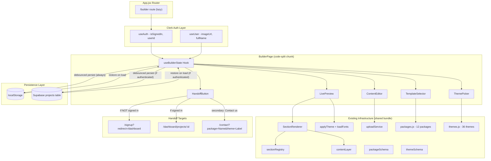
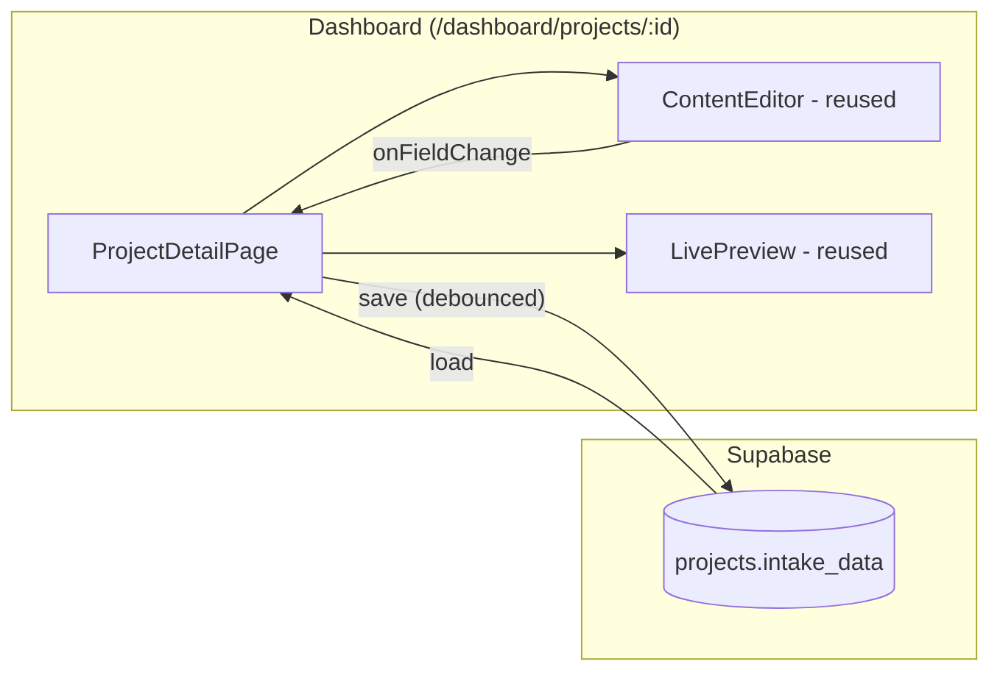

# Design Document: WeBuilder Preview UI

## Overview

The WeBuilder Preview UI is a public-facing, auth-aware website builder at `/builder` that lets potential clients select a template, fill in content, customize a theme, and see a live preview — all without signing up. It serves as a lead-generation tool that hands off the user's configuration to either the sign-up flow (unauthenticated) or directly to the dashboard (authenticated) when they're ready to purchase.

The builder integrates into the existing Adverse Solutions architecture by reusing the SectionRenderer, Section_Registry, Theme_Engine, Content_Layer, and Upload_Service. No new rendering infrastructure is needed — the builder is essentially a guided editor that produces a Package_Config and feeds it to the same rendering pipeline used by PackageDetailPage.

**Business Context:**
- Auth: Clerk (`@clerk/clerk-react`) — domain `adversesolutions.com`, Frontend API at `clerk.adversesolutions.com`
- Database: Supabase (profiles, projects tables with `text` IDs for Clerk user IDs like `user_2abc...`)
- Phase 1: Free preview builder (lead-gen, no auth required, localStorage + optional Supabase persistence)
- Phase 2: Client editing dashboard (Supabase persistence, Clerk auth-gated, content-only edits via `/dashboard`)
- Revenue model: Builder drives leads → sign-up → dashboard project → service engagement ($1,500–$5,000+ packages)
- Subscription model (Adverse Pro) planned for premium features in future phases

**Key Design Decisions:**
- Builder does NOT require auth, but IS auth-aware via Clerk's `useAuth()` hook
- Unauthenticated: state in React + localStorage only
- Authenticated: state in React + localStorage + Supabase `projects` table (dual persistence)
- The builder is code-split from the main bundle via React.lazy
- Split-panel layout on desktop (editor + live preview), toggle on mobile
- Auth-aware handoff: unauthenticated → `/signup` with pending config; authenticated → create project → `/dashboard`
- Reuses all existing data (12 packages across 4 categories, 36 themes) without duplication
- Uses `packageType: "semi-dynamic"` for the working copy so Content_Layer editing APIs work
- ContentEditor designed as a reusable module for Phase 2 dashboard integration

## Architecture



**Data Flow:**
1. User selects a template → BuilderState initializes with a deep copy of the package config (packageType set to "semi-dynamic")
2. User edits content → BuilderState updates in-memory config → LivePreview re-renders affected section
3. User picks/customizes theme → BuilderState updates active theme → applyTheme re-applies tokens + loadFonts loads Google Fonts
4. BuilderState debounces writes to localStorage (always) and Supabase (if authenticated) for session persistence
5. User clicks CTA:
   - **Unauthenticated:** Config saved to `localStorage:webuilder_pending_config` → navigate to `/signup?redirect=/dashboard` → after sign-up, dashboard reads pending config → creates project → clears pending key
   - **Authenticated:** Config saved to Supabase `projects` table (new project with `intake_data`) → redirect to `/dashboard/projects/:id`
6. Phase 2: Dashboard loads project's `intake_data` → renders via SectionRenderer + ContentEditor for edits

## Components and Interfaces

### BuilderPage (Route Component)

```jsx
// src/pages/BuilderPage.jsx — lazy-loaded via React.lazy in App.jsx
// Orchestrates the builder flow: template selection → editing + preview → handoff
// Auth-aware: reads Clerk state but does not require it

import { useAuth, useUser } from '@clerk/clerk-react';

export default function BuilderPage() {
  const { isSignedIn, userId } = useAuth();
  const { user } = useUser();
  // Uses useBuilderState hook for all state management (passes userId for Supabase persistence)
  // Renders TemplateSelector OR (ContentEditor + LivePreview) based on step
}
```

### useBuilderState Hook

```javascript
// src/hooks/useBuilderState.js
// Central state management hook for the builder
// Auth-aware: persists to Supabase when userId is provided

import { useSupabaseClient } from '../hooks/useSupabaseClient';

/**
 * @typedef {Object} BuilderState
 * @property {'select'|'edit'} step - Current builder step
 * @property {object|null} config - Working Package_Config (deep copy, packageType: "semi-dynamic")
 * @property {object|null} activeTheme - Current theme object (may include color overrides)
 * @property {number} baseThemeIndex - Index into package's theme array in themes.js
 * @property {string|null} category - Selected business category
 * @property {string|null} packageSlug - Selected package slug (for theme lookup)
 * @property {Record<string,string>|null} customColors - Color token overrides
 * @property {boolean} hasRestoredSession - Whether we restored from localStorage or Supabase
 * @property {string|null} supabaseProjectId - ID of the draft project in Supabase (if authenticated)
 * @property {boolean} isAuthenticated - Whether the user is signed in via Clerk
 * @property {boolean} isSavingToSupabase - Whether a Supabase save is in progress
 * @property {string|null} supabaseSaveError - Last Supabase save error message (null if no error)
 */

/**
 * @typedef {Object} BuilderActions
 * @property {(slug: string) => void} selectTemplate
 * @property {() => void} selectBlankTemplate
 * @property {(sectionKey: string, fieldPath: string, value: any) => void} updateField
 * @property {(index: number) => void} selectTheme
 * @property {(tokenKey: string, value: string) => void} customizeColor
 * @property {() => void} resetTheme
 * @property {() => {package: string, theme: string}} getHandoffParams
 * @property {() => void} clearSession
 * @property {() => void} startFresh
 * @property {() => void} resumeSession
 * @property {() => Promise<string>} saveToSupabase - Creates/updates project, returns project ID
 * @property {() => Promise<object|null>} loadFromSupabase - Loads most recent draft project
 */

/**
 * @param {Object} options
 * @param {string|null} options.userId - Clerk user ID (null if unauthenticated)
 * @returns {[BuilderState, BuilderActions]}
 */
export function useBuilderState({ userId = null }) {
  const supabase = useSupabaseClient(); // authenticated client (null if not signed in)
  // Returns [state, actions]
  // When userId is provided:
  //   - saveToSupabase() upserts to projects table on debounced interval
  //   - loadFromSupabase() fetches most recent draft project for this user
  //   - Falls back to localStorage if Supabase save fails
}
```

### TemplateSelector

```jsx
// src/components/builder/TemplateSelector.jsx
// Step 1: Category selection → template selection

// Props:
// - onSelectTemplate: (slug: string) => void
// - onSelectBlank: () => void
```

Renders:
- Category filter cards (4 categories derived from packages data)
- Template grid showing packages in selected category (name, description, hero image thumbnail)
- "Start Blank" option with all 6 sections + placeholder content
- Responsive grid: 2 cols mobile, 3 cols tablet, 4 cols desktop

### ContentEditor

```jsx
// src/components/builder/ContentEditor.jsx
// Left panel: section-by-section content editing form
// REUSABLE: designed to be imported by both BuilderPage and DashboardProjectPage (Phase 2)

// Props:
// - config: PackageConfig
// - onFieldChange: (sectionKey: string, fieldPath: string, value: any) => void
// - readOnly?: boolean (for Phase 2: view-only mode for static packages)
```

Renders:
- Collapsible section groups (hero, services, gallery, testimonials, cta, contact)
- Field inputs matching EDITABLE_FIELDS definitions from contentLayer
- Array field controls (add/remove items for services, gallery, testimonials)
- Image upload controls (delegating to uploadService with "builder-preview/" path prefix)
- Inline validation errors (500 char limit, URL format, array max items)

### ThemePicker

```jsx
// src/components/builder/ThemePicker.jsx
// Theme selection and color customization panel

// Props:
// - packageSlug: string (key into themes.js)
// - activeThemeIndex: number
// - customColors: Record<string, string> | null
// - onSelectTheme: (index: number) => void
// - onCustomizeColor: (tokenKey: string, value: string) => void
// - onReset: () => void
```

Renders:
- 3 theme cards with label + color swatches (accent, bgBase, textPrimary)
- Color customization mode with 10 color picker inputs (all required color tokens)
- Hex validation feedback (regex: `/^#([0-9a-fA-F]{3}|[0-9a-fA-F]{6}|[0-9a-fA-F]{8})$/`)
- Reset button to restore original theme

### LivePreview

```jsx
// src/components/builder/LivePreview.jsx
// Right panel: real-time rendered preview using SectionRenderer
// REUSABLE: can be imported by dashboard for "Preview Site" modal (Phase 2)

// Props:
// - config: PackageConfig
// - theme: ThemeObject
// - layout: string (derived from category via CATEGORY_LAYOUT_MAP)
```

Renders:
- A scoped container with theme tokens applied via `applyTheme(element, theme)` + `loadFonts(theme)`
- SectionRenderer with the current config, theme, and layout
- Same visual output as PackageDetailPage (first section sync, rest lazy + scroll animation)

### HandoffButton

```jsx
// src/components/builder/HandoffButton.jsx
// Persistent CTA — auth-aware: different behavior for signed-in vs anonymous users

import { useAuth } from '@clerk/clerk-react';
import { useNavigate } from 'react-router-dom';
import { useSupabaseClient } from '../../hooks/useSupabaseClient';

// Props:
// - config: PackageConfig (full config for Supabase save)
// - packageName: string
// - themeLabel: string
// - category: string (for service_tier)
// - onDownloadConfig: () => void
```

Renders:
- Sticky bottom bar (matching PackageDetailPage's persistentCta pattern)
- **If NOT signed in:**
  - "Get This Website" primary button → saves config to `localStorage:webuilder_pending_config` → navigates to `/signup?redirect=/dashboard`
- **If signed in:**
  - "Save & Go to Dashboard" primary button → creates project in Supabase → redirects to `/dashboard/projects/:id`
- "Download Config" secondary action → downloads Package_Config as JSON file (both states)
- "Prefer to talk first? Contact us" tertiary link → `/contact?package=Name&theme=Label`

**Supabase project creation (authenticated handoff):**
```javascript
const createProject = async (supabase, userId, config, category) => {
  const { data, error } = await supabase
    .from('projects')
    .insert({
      client_id: userId,          // text, Clerk user ID (e.g., "user_2abc...")
      name: config.name || 'Custom Website',
      service_tier: category,     // e.g., "Food & Hospitality"
      intake_data: config,        // jsonb, full Package_Config
      status: 'active',           // handoff creates an active project (not draft)
    })
    .select('id')
    .single();
  return data?.id;
};
```

### BuilderLayout

```jsx
// src/components/builder/BuilderLayout.jsx
// Responsive split-panel layout with draggable divider

// Props:
// - editor: ReactNode
// - preview: ReactNode
// - isMobile: boolean
```

Renders:
- Desktop (≥768px): side-by-side with draggable divider
- Mobile (<768px): full-width with toggle between editor/preview

## Data Models

### Builder State Shape (localStorage)

```json
{
  "step": "edit",
  "packageSlug": "restaurant",
  "config": {
    "slug": "restaurant",
    "name": "Restaurant",
    "category": "Food & Hospitality",
    "description": "...",
    "packageType": "semi-dynamic",
    "themeRef": "restaurant-candlelit",
    "sections": {
      "hero": { "headline": "...", "subheadline": "...", "ctaText": "...", "heroImage": "..." },
      "services": { "heading": "...", "items": [...] },
      "gallery": { "heading": "...", "images": [...] },
      "testimonials": { "heading": "...", "items": [...] },
      "cta": { "heading": "...", "body": "...", "buttonText": "..." },
      "contact": { "heading": "...", "phone": "...", "email": "...", "address": "...", "hours": "..." }
    }
  },
  "baseThemeIndex": 0,
  "customColors": { "accent": "#ff6600" },
  "category": "Food & Hospitality",
  "timestamp": 1700000000000,
  "supabaseProjectId": "proj_abc123"
}
```

**localStorage keys:**
- `webuilder_preview_session` — current builder session state
- `webuilder_pending_config` — config saved during unauthenticated handoff (cleared by dashboard after project creation)

### Supabase Project Schema (authenticated persistence)

```sql
-- projects table (existing, used by dashboard)
-- profiles.id is text type (Clerk user IDs like "user_2abc...")
-- projects.client_id is text referencing profiles.id

INSERT INTO projects (client_id, name, service_tier, intake_data, status)
VALUES (
  'user_2abc...',           -- Clerk user ID from useAuth().userId
  'Restaurant',             -- config.name
  'Food & Hospitality',     -- category
  '{"slug":"restaurant","packageType":"semi-dynamic",...}',  -- full Package_Config as JSONB
  'draft'                   -- 'draft' for auto-save, 'active' for handoff
);
```

**Draft vs Active:**
- `status: "draft"` — auto-saved by the builder during editing (upserted on debounce)
- `status: "active"` — created by the handoff button (final submission to dashboard)
- The builder only ever has ONE draft project per user (upsert by `client_id` + `status = 'draft'`)

### Handoff Flows

**Unauthenticated user handoff:**
```javascript
// 1. User clicks "Get This Website" (not signed in)
localStorage.setItem('webuilder_pending_config', JSON.stringify(config));
navigate('/signup?redirect=/dashboard');

// 2. After sign-up, Clerk redirects to /dashboard
// 3. Dashboard checks for pending config:
const pending = localStorage.getItem('webuilder_pending_config');
if (pending) {
  const config = JSON.parse(pending);
  await supabase.from('projects').insert({
    client_id: userId,
    name: config.name,
    service_tier: config.category,
    intake_data: config,
    status: 'active',
  });
  localStorage.removeItem('webuilder_pending_config');
}
```

**Authenticated user handoff:**
```javascript
// 1. User clicks "Save & Go to Dashboard" (signed in)
const { data } = await supabase.from('projects').insert({
  client_id: userId,
  name: config.name,
  service_tier: category,
  intake_data: config,
  status: 'active',
}).select('id').single();

navigate(`/dashboard/projects/${data.id}`);
```

### Blank Template Config

```javascript
const BLANK_TEMPLATE = {
  slug: "custom-builder",
  name: "Custom Website",
  category: "Professional",
  description: "A custom website built with the Adverse Builder",
  packageType: "semi-dynamic",
  themeRef: "", // assigned when theme is selected
  sections: {
    hero: { headline: "Your Business Name", subheadline: "Your tagline here", ctaText: "Get Started", heroImage: "" },
    services: { heading: "Our Services", items: [{ title: "Service 1", description: "Describe your service", icon: "⭐" }] },
    gallery: { heading: "Our Work", images: [] },
    testimonials: { heading: "What Clients Say", items: [{ quote: "Great service!", author: "Happy Client", role: "Customer" }] },
    cta: { heading: "Ready to Get Started?", body: "Contact us today.", buttonText: "Contact Us" },
    contact: { heading: "Get In Touch", phone: "", email: "", address: "", hours: "" }
  }
};
```

### Color Validation

Valid CSS color formats accepted by the ThemePicker:
- `#RGB` (3 hex digits)
- `#RRGGBB` (6 hex digits)
- `#RRGGBBAA` (8 hex digits)

Regex: `/^#([0-9a-fA-F]{3}|[0-9a-fA-F]{6}|[0-9a-fA-F]{8})$/`

### Category → Layout Mapping (existing)

```javascript
const CATEGORY_LAYOUT_MAP = {
  Professional: "professional",
  "Beauty & Wellness": "beauty",
  "Home Services": "homeServices",
  "Food & Hospitality": "foodHospitality",
};
```

## Correctness Properties

### Property 1: Category filtering returns only matching packages

*For any* set of packages and any selected category, the filtered results SHALL contain only packages whose category field exactly matches the selected category, and SHALL contain all such packages from the source data.

**Validates: Requirements 2.1, 2.2**

### Property 2: Template selection produces independent deep copy

*For any* valid Package_Config, selecting it as a template SHALL produce a Builder_State config that is deeply equal to the original (except packageType is "semi-dynamic"), and mutating any field in the copy SHALL NOT affect the original package data in `src/data/packages.js`.

**Validates: Requirements 2.3**

### Property 3: Content field validation correctness

*For any* string input to a content field, the validator SHALL reject strings exceeding 500 characters, reject URL fields not matching `http://`, `https://`, or `/` prefixes, reject service arrays exceeding 20 items, reject gallery arrays exceeding 30 items, and reject testimonial arrays exceeding 20 items — while accepting all inputs that satisfy these constraints.

**Validates: Requirements 3.3**

### Property 4: Array field add/remove length invariant

*For any* array field (services items, gallery images, testimonial items) with current length N, adding an item SHALL produce length N+1 containing the new item, and removing an item at a valid index SHALL produce length N-1 with that item absent and all other items preserved in order.

**Validates: Requirements 3.5**

### Property 5: Section rendering order preservation

*For any* valid Package_Config with sections defined, the Live_Preview SHALL render sections in the same order they appear in the config's sections object, with no sections omitted or reordered.

**Validates: Requirements 4.4**

### Property 6: Empty content graceful handling

*For any* Package_Config where one or more section fields are empty strings, null, undefined, or empty arrays, the rendered output SHALL NOT contain the literal text "undefined" or "null", and SHALL NOT throw a runtime error.

**Validates: Requirements 4.5**

### Property 7: Theme color override merge preserves non-overridden tokens

*For any* base theme and any subset of color token overrides, the resulting merged theme SHALL equal the base theme for all non-overridden token keys (including typography and shape), and SHALL equal the override value for all overridden color token keys.

**Validates: Requirements 5.4**

### Property 8: Hex color validation accepts only valid formats

*For any* string, the color validator SHALL accept it if and only if it matches the pattern `#RGB`, `#RRGGBB`, or `#RRGGBBAA` (where R, G, B, A are hexadecimal digits). All other strings SHALL be rejected.

**Validates: Requirements 5.5**

### Property 9: Theme reset round-trip restores original

*For any* base theme with any number of color customizations applied, invoking the reset action SHALL produce a theme deeply equal to the original base theme before any customizations were applied.

**Validates: Requirements 5.7**

### Property 10: Upload failure preserves Builder_State

*For any* Builder_State and any upload failure (size, MIME type, network, or storage error), the Package_Config in Builder_State SHALL remain deeply equal to its value before the upload was attempted.

**Validates: Requirements 6.4**

### Property 11: localStorage persistence round-trip

*For any* valid Builder_State, serializing it to localStorage and then deserializing (resuming) SHALL produce a Builder_State deeply equal to the original, preserving config, theme index, category, packageSlug, customColors, and step.

**Validates: Requirements 7.2, 7.4**

### Property 12: Handoff URL parameters match state (contact fallback)

*For any* valid Builder_State in the edit step with a non-null config and theme, the generated contact fallback URL SHALL contain query parameter `package` equal to the config's `name` field and query parameter `theme` equal to the active theme's `label` field.

**Validates: Requirements 8.7**

### Property 13: Config export JSON round-trip

*For any* valid Package_Config in the Builder_State, exporting it as JSON and parsing the resulting string back SHALL produce an object deeply equal to the original config.

**Validates: Requirements 8.4**

### Property 14: Semi-dynamic packageType enables editing

*For any* template selected in the builder (including blank template), the resulting Builder_State config SHALL have `packageType: "semi-dynamic"`, ensuring the Content_Layer's `editField()` API does not reject edits with "static packages do not support content editing".

**Validates: Requirements 2.3, 3.2**

### Property 15: Auth-aware handoff produces correct Supabase row

*For any* valid Builder_State with an authenticated user (userId is non-null), the handoff action SHALL produce a Supabase `projects` insert with `client_id` equal to the userId, `service_tier` equal to the config's category, `intake_data` deeply equal to the full Package_Config, and `status` equal to "active".

**Validates: Requirements 8.3, 13.2**

### Property 16: Supabase draft upsert idempotency

*For any* authenticated Builder_State, calling saveToSupabase() multiple times with the same userId SHALL result in exactly one draft project row (upsert behavior), with `intake_data` reflecting the most recent state.

**Validates: Requirements 13.3**

## Error Handling

### localStorage Errors

| Scenario | Behavior |
|----------|----------|
| localStorage unavailable (private browsing, disabled) | Builder continues with in-memory state only. Non-blocking toast notification: "Auto-save unavailable. Your progress won't be saved if you close this tab." |
| localStorage quota exceeded | Catch `QuotaExceededError`, display toast: "Storage full. Your progress is saved in memory but may be lost if you close this tab." Continue with in-memory state. |
| localStorage data corrupted (invalid JSON) | Catch parse error, discard corrupted entry, start fresh. Log warning to console. |
| localStorage schema mismatch (old format) | Detect missing required fields, discard stale entry, start fresh. No error shown to user. |

### Supabase Persistence Errors (Authenticated Users)

| Scenario | Behavior |
|----------|----------|
| Network error during auto-save | Fall back to localStorage-only. Non-blocking toast: "Cloud save unavailable. Your progress is saved locally." Set `supabaseSaveError` in state. Retry on next debounce interval. |
| RLS policy denial (403) | Fall back to localStorage-only. Toast: "Cloud save unavailable. Your progress is saved locally." Log warning. Do not retry until next user action. |
| Supabase server error (500) | Fall back to localStorage-only. Toast: "Cloud save unavailable. Your progress is saved locally." Retry with exponential backoff (max 3 retries). |
| Project creation fails during handoff | Display inline error on CTA button: "Could not save project. Try again or download your config." Offer "Download Config" as fallback. Do not navigate away. |
| Conflict (draft already exists with different data) | Upsert resolves conflict — most recent write wins. No user-facing error. |
| User signs out mid-session | Continue with localStorage-only persistence. Clear `supabaseProjectId` from state. Builder remains functional. |

### Upload Errors

| Scenario | Behavior |
|----------|----------|
| File exceeds 5 MB | Reject before upload attempt. Inline error: "File too large. Maximum size is 5 MB." Field value unchanged. |
| Invalid MIME type | Reject before upload attempt. Inline error: "Unsupported file type. Use JPEG, PNG, WebP, or SVG." Field value unchanged. |
| Network error during upload | Catch fetch/network error. Inline error: "Upload failed. Check your connection and try again." Field value unchanged. Loading indicator removed. |
| Supabase storage error (403, 500) | Catch response error. Inline error: "Upload failed. Please try again later." Field value unchanged. Loading indicator removed. |
| Concurrent upload to same field | Disable upload control while in-progress (loading state). Second attempt blocked until first resolves. |

### Theme Customization Errors

| Scenario | Behavior |
|----------|----------|
| Invalid hex color entered | Inline error below input: "Enter a valid hex color (#RGB, #RRGGBB, or #RRGGBBAA)." Previous valid color preserved in state. Preview unchanged. |
| Theme data missing for package slug | Fall back to first available theme in themes data. If no themes exist at all, apply hardcoded default tokens (white bg, dark text, blue accent). |
| applyTheme throws (malformed tokens) | Catch error, preserve previous theme state, log warning. Toast: "Theme could not be applied. Using previous theme." |

### Content Editing Errors

| Scenario | Behavior |
|----------|----------|
| Field value exceeds 500 character limit | Inline error: "Maximum 500 characters." Input not truncated — user can see and fix. Preview renders truncated value. |
| URL field with invalid format | Inline error: "Enter a valid URL starting with http://, https://, or /." Field value stored but flagged. Preview renders the raw value. |
| Array field at maximum capacity | Disable "Add" button. Tooltip: "Maximum {N} items reached." |
| Paste event with very large content | Accept paste, validate, show error if over limit. No crash or freeze. |

### General Error Boundary

The BuilderPage component wraps its content in a React Error Boundary that:
1. Catches any unhandled render errors within the builder
2. Displays a friendly error state: "Something went wrong. Your progress has been saved." with a "Reload Builder" button
3. Preserves localStorage state so the user can resume after reload
4. Logs the error stack to console for debugging

## Testing Strategy

### Property-Based Tests (fast-check)

Property tests are the primary correctness verification mechanism. Each test uses `fast-check` with a minimum of 100 iterations and references its design document property.

| Property | Test File | Generators |
|----------|-----------|------------|
| 1: Category filtering | `property-preview-ui-category-filter.test.js` | `fc.constantFrom(...packages)`, `fc.constantFrom(...categories)` |
| 2: Deep copy independence | `property-preview-ui-deep-copy.test.js` | `fc.record()` generating valid Package_Config shapes |
| 3: Content validation | `property-preview-ui-validation.test.js` | `fc.string()`, `fc.nat()`, `fc.array()` with varying lengths |
| 4: Array add/remove invariant | `property-preview-ui-array-ops.test.js` | `fc.array(fc.record(...))`, `fc.nat()` for indices |
| 5: Section rendering order | `property-preview-ui-section-order.test.jsx` | `fc.shuffledSubarray()` of section keys |
| 6: Empty content handling | `property-preview-ui-empty-content.test.jsx` | `fc.record()` with `fc.option()` for nullable fields |
| 7: Theme override merge | `property-preview-ui-theme-merge.test.js` | `fc.record()` for base theme, `fc.subrecord()` for overrides |
| 8: Hex color validation | `property-preview-ui-hex-validation.test.js` | `fc.hexaString()`, `fc.string()`, `fc.constantFrom('#')` compositions |
| 9: Theme reset round-trip | `property-preview-ui-theme-reset.test.js` | `fc.record()` for themes, `fc.array(fc.tuple())` for override sequences |
| 10: Upload failure state preservation | `property-preview-ui-upload-failure.test.js` | `fc.record()` for state, `fc.constantFrom(...errorTypes)` |
| 11: localStorage round-trip | `property-preview-ui-localstorage.test.js` | `fc.record()` generating full BuilderState shapes |
| 12: Handoff URL params (contact) | `property-preview-ui-handoff.test.js` | `fc.record()` for valid BuilderState |
| 13: Config export round-trip | `property-preview-ui-export.test.js` | `fc.record()` generating valid Package_Config |
| 14: Semi-dynamic packageType | `property-preview-ui-package-type.test.js` | `fc.constantFrom(...packageSlugs)` |
| 15: Auth handoff Supabase row | `property-preview-ui-auth-handoff.test.js` | `fc.record()` for BuilderState + `fc.string()` for userId |
| 16: Supabase draft upsert idempotency | `property-preview-ui-draft-upsert.test.js` | `fc.record()` for state, `fc.array(fc.record())` for multiple saves |

**Tag format:** Each test file includes a comment header:
```javascript
// Feature: webuilder-preview-ui, Property {N}: {property title}
// **Validates: Requirements X.Y**
```

**Configuration:** All property tests use `{ numRuns: 100 }` minimum.

### Unit Tests (@testing-library/react)

Unit tests cover specific examples, edge cases, and UI behaviors not suitable for property-based testing:

| Area | Test File | Coverage |
|------|-----------|----------|
| TemplateSelector rendering | `builder-template-selector.test.jsx` | 4 category cards render, 12 templates available, blank template option, empty category message |
| ContentEditor field rendering | `builder-content-editor.test.jsx` | All 6 section groups render, collapse/expand, field grouping |
| ThemePicker UI | `builder-theme-picker.test.jsx` | 3 theme cards with swatches, 10 color inputs in customization mode, reset button |
| LivePreview integration | `builder-live-preview.test.jsx` | Renders SectionRenderer with correct props, applies layout variant |
| HandoffButton (unauth) | `builder-handoff-unauth.test.jsx` | Shows "Get This Website", saves to localStorage, navigates to /signup |
| HandoffButton (auth) | `builder-handoff-auth.test.jsx` | Shows "Save & Go to Dashboard", creates Supabase project, navigates to /dashboard |
| BuilderLayout responsive | `builder-layout.test.jsx` | Split-panel at ≥768px, toggle at <768px, draggable divider |
| Accessibility | `builder-accessibility.test.jsx` | ARIA landmarks, keyboard navigation, aria-describedby on errors, aria-live regions |
| Upload UI | `builder-upload.test.jsx` | Loading indicator, duplicate prevention, URL input alternative |
| Session resume dialog | `builder-session-resume.test.jsx` | Resume/fresh choice shown, correct action on each choice, Supabase vs localStorage priority |
| Error boundary | `builder-error-boundary.test.jsx` | Catches render errors, shows recovery UI, preserves localStorage |
| Auth-aware navbar | `builder-auth-navbar.test.jsx` | Avatar shown when signed in, no avatar when anonymous |
| Supabase persistence | `builder-supabase-persistence.test.jsx` | Auto-save to Supabase, fallback on error, draft upsert behavior |

### Integration Tests

Integration tests verify the full builder flow end-to-end within the test environment:

| Flow | Test File | Scenario |
|------|-----------|----------|
| Happy path (unauth) | `builder-integration-unauth.test.jsx` | Select template → edit → handoff → /signup with pending config |
| Happy path (auth) | `builder-integration-auth.test.jsx` | Select template → edit → handoff → Supabase project → /dashboard |
| Session persistence | `builder-session-integration.test.jsx` | Edit → close → reopen → resume → verify state matches |
| Upload flow | `builder-upload-integration.test.jsx` | Select image field → upload file → verify URL in state and preview |
| localStorage unavailable | `builder-no-storage-integration.test.jsx` | Mock localStorage throw → verify builder works in-memory |
| Supabase failure fallback | `builder-supabase-fallback.test.jsx` | Mock Supabase error → verify localStorage fallback + toast |
| Pending config pickup | `builder-pending-config.test.jsx` | Set pending config → mount dashboard → verify project created + key cleared |

### Test Execution

```bash
# All builder tests
npx vitest --run src/__tests__/property-preview-ui-* src/__tests__/builder-*

# Property tests only
npx vitest --run src/__tests__/property-preview-ui-*

# Unit tests only
npx vitest --run src/__tests__/builder-*

# Full suite (includes existing tests to verify no regressions)
npm run test
```

### Coverage Goals

- **Property tests:** Cover all 16 correctness properties with 100+ iterations each
- **Unit tests:** Cover all UI states, edge cases, accessibility requirements, and auth-aware behavior
- **Integration tests:** Cover the 7 critical user flows end-to-end
- **Existing tests:** Zero regressions — all existing `src/__tests__/property-*` tests continue to pass

## Phase 2: Dashboard Integration

This section describes how the dashboard will reuse builder components to provide client editing capabilities. Implementation is deferred to Phase 2, but the builder architecture is designed to support it without changes.

### Component Reuse

| Builder Component | Dashboard Usage |
|-------------------|----------------|
| ContentEditor | Imported by `ProjectDetailPage` for content editing (semi-dynamic packages only) |
| LivePreview | Imported by `ProjectDetailPage` for "Preview Site" modal rendering |
| SectionRenderer | Already shared — renders both builder preview and dashboard preview |
| Theme_Engine | Already shared — applies package theme tokens in both contexts |

### Data Flow (Phase 2)



**Flow:**
1. Client navigates to `/dashboard/projects/:id`
2. `ProjectDetailPage` loads the project row, extracts `intake_data` (Package_Config)
3. If `packageType === "semi-dynamic"`, renders ContentEditor with the config
4. Client edits content → `onFieldChange` updates local state → LivePreview re-renders
5. Changes are debounce-saved back to `projects.intake_data` via `useSupabaseClient()`
6. "Preview Site" button opens a full-page modal with LivePreview rendering the config

### Dashboard Route Changes (Phase 2)

The existing `/dashboard/projects/:id` route (ProjectDetailPage) will be enhanced:
- Add a "Preview Site" button that opens LivePreview in a modal
- Add a "Edit Content" tab that renders ContentEditor (for semi-dynamic packages)
- Add a "Request Changes" action that creates a message thread
- Display project metadata: name, service tier, status, dates

### ContentEditor Reusability Contract

To ensure ContentEditor works in both builder and dashboard contexts:
- It accepts `config` and `onFieldChange` as props (no internal state management)
- It does NOT import or depend on `useBuilderState` or any builder-specific hook
- It does NOT handle persistence (that's the parent's responsibility)
- It optionally accepts `readOnly` prop to disable editing for static packages
- It uses the Content_Layer's `getEditableFields()` to determine available fields
- It uses CSS Modules for styling (no global CSS dependencies beyond tokens)
